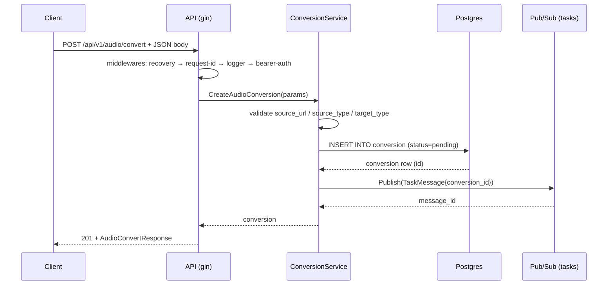

# Manifest Extraction Guide — 每個欄位的值去 repo 哪裡找

> 本文件是 `manifest-template.md` 的**實作搭檔**。template 定義「寫什麼」，本文件告訴你「值從哪裡挖」。
>
> 涵蓋語言 / 框架：
> - **Go**（Gin / GORM / GCP Pub/Sub）
> - **Python**（FastAPI / Flask / Django / Celery / SQLAlchemy）
> - 其他語言（Node Express / Koa、Java Spring Boot）延伸原則相同
>
> 若遇到本文件未涵蓋的技術棧，沿用以下原則即可：
> 1. HTTP endpoint 資訊從 routing framework 的宣告處挖
> 2. DB schema 從 migrations 或 ORM model 挖
> 3. Pub/Sub / 背景任務從 publisher / subscriber / scheduler 定義處挖
> 4. Infra / 部署資訊從 IaC repo 挖（常見 layout：`<iac-repo>/terraform/<service>/configs/*.tfvars`）
>
> 注意：yaml 寫在 **`$CARTOGRAPH_HOME/data/<repo-id>/`**（由 `cartograph-init` / `cartograph-continue` / `cartograph-update` skill 管理），source repo 本身不動。

---

## 0. 通用原則

| 原則 | 說明 |
|---|---|
| **code 為真，docs 為輔** | `code_ref` 必須指向真的存在的 symbol；手寫 description 可以，但編碼事實（欄位、status、URL）從 code 取 |
| **runtime 為真，config 為輔** | 實際跑起來會是什麼值 > .env.example 寫了什麼 |
| **不猜** | 不確定的欄位寧可留空，讓 aggregator 顯示 "—"，也不要寫錯誤的 hint |
| **id 以現實名字為準** | table id = 實際 DB table 名；topic id = 實際 Pub/Sub topic 名；API id = handler 短名（kebab-case） |
| **全 repo 一致性** | 同一個 code_ref 格式跨 repo 一致；middleware pipeline id 命名跨 repo 一致 |

---

## 1. `service.yaml`

| 欄位 | 資料來源 | Go 挖法 | Python 挖法 |
|---|---|---|---|
| `id` | 短名慣例 | source 資料夾 basename；或手動指定（`cartograph-init --id`） | 同 |
| `repo`（選填） | GitHub remote | 若 `git remote get-url origin` 是 `github.com/<org>/<name>` → 填 `<org>/<name>`；local-only 或非 GitHub remote → **整個欄位省略**（`CodeRef` 改 render 純文字，不連 GitHub） | 同 |
| `team` | 組織慣例 | CODEOWNERS / README / 直接問 | 同 |
| `description` | README | 讀 README 首段寫一行摘要 | 同 |
| `tech[]` | 手寫 | go.mod（`require` 主要框架）+ infra.md | `pyproject.toml` / `requirements.txt` 的主框架 |
| `components[]` | binary 入口 | 掃 `cmd/*/main.go`；每個資料夾一個 component | `pyproject.toml#[project.scripts]` + Procfile + Dockerfile `CMD` |
| `components[].binary` | build output | `cmd/api` / `cmd/worker` 路徑 | uvicorn / celery / RQ 啟動命令字串 |
| `apis[]` | 路由註冊 | 見 §2 Go 路由掃描 | 見 §2 Python 路由掃描 |
| `workers[]` | 背景任務 | 見 §3 | 見 §3 |
| `tables[]` | migrations / ORM | `migrations/*.sql` 或 GORM `AutoMigrate` | `alembic/versions/*.py` 或 Django `models.py` |
| `topics_produced[]` | publisher | grep `pubsub.Topic(...)` / `Publish(` | grep `publisher.publish(...)` |
| `topics_consumed[]` | subscriber | grep `subscription.Receive(` | grep `subscriber.subscribe(...)` / Celery `@task` if 關聯 pubsub |
| `integrations[]` | adapter / client | 掃 `internal/adapter/` 或 `pkg/client/` | 掃 `app/integrations/` / `services/` / requirements 裡的 SDK |
| `depends_on_infra[]` | infra.md | 讀 `docs/infra.md` 第 1-3 節 | 同 |
| `middleware_pipelines[]` | router 設定 | 看 gin `router.Group(...).Use(...)` 註冊順序 | FastAPI `app.add_middleware(...)` 順序 / Django `MIDDLEWARE` 列表 / Flask `before_request` 鏈 |
| `env_config[]` | env 讀取 | grep `os.Getenv("APP_")` / `kingpin.Envar(` | grep `os.environ[`  / `pydantic.BaseSettings` / Django `settings.py` |
| `environments[]` | **Terraform** | `<iac-repo>/terraform/shared-resource/<repo>/configs/*.tfvars` + `docs/infra.md#Environments` | 同 |

### 1.1 `environments[]` 特別說明

**先判斷 `deployment_type`**：看 repo 是 Cloud Run 還是 GKE，兩者挖法不同。

#### Cloud Run 類

資料來源：**Terraform**
- tfvars 位置：`<iac-repo>/terraform/shared-resource/<repo>/configs/*.tfvars`
- `gcp_project` ← tfvars 的 `project_id`
- `region` ← tfvars 的 `region`
- `api_url_pattern` ← `gcloud run services describe <service>-{env}` 的 URL（加 `*` wildcard 代表 hash 子字串）
- `gcs_bucket` ← tfvars 的 `<repo>_gcs_bucket`
- `cdn_url_prefix` ← `<iac-repo>/terraform/shared-resource/infra/configs/{env}.tfvars` 的 `bucket_routes` 中本 repo 的 route

#### GKE 類

資料來源分散多個 repo，需綜合：
- **Terraform**：`<iac-repo>/terraform/<repo>/gcp/configs/{env}.tfvars`
  - `gcp_project` ← `project_id`
  - `shared_resource_project` ← `shared_resource_project_id`（Pub/Sub 所在）
  - `region` ← `region`（若無則 default `asia-east1`，見 `variables.tf`）
  - `api_url` ← tfvars 的 `<repo>_base_url`（前面加 `https://`）
  - `cdn_domain` ← `storage_cdn_domain_name`
  - `db_instance` ← `db_name`
  - `redis_instance` ← `redis_name`
  - `terraform_ref` ← tfvars path 本身
- **Helm values**：`<iac-repo>/argocd/<repo>/{env}-values.yaml`
  - `image_repo` ← `image.repository`
  - `helm_values_ref` ← 該檔 path 本身
- **ArgoCD application**：`<argo-resources-repo>/applications/{tw|jp}/<env>-<repo>/`
  - `argocd_app_ref` ← 該資料夾 path

#### 通用

**不可以**用 `{env}` 模板代替明列 —— `jp-production` 不符合 `{env}` pattern。各 env 明列。

---

## 2. `apis/<id>.yaml`

### 2.1 找所有 endpoint（`service.yaml#apis[]`）

**Go (Gin)**：
```go
// internal/router/router.go
r.GET("/api/health", h.handlerHealthCheck)
v1 := r.Group("/api/v1", auth.Required())
v1.POST("/audio/convert", h.handlerPostAudioConvert)
```
→ 逐行掃 `router.go` 或 `routes.go`，每個 `r.{METHOD}(path, handler)` 是一支 API。

**Python (FastAPI)**：
```python
@app.post("/api/v1/audio/convert", response_model=AudioConvertResponse)
def create_audio_convert(payload: AudioConvertRequest, ...):
    ...
```
→ 掃 `@app.{method}` / `@router.{method}` decorator。

**Python (Django REST Framework)**：
→ 看 `urls.py` 的 `path(...)` / `url(...)`；或 `@api_view` decorator。

**Python (Flask)**：
→ 看 `@app.route(..., methods=[...])`。

### 2.2 逐欄位

| 欄位 | Go | Python |
|---|---|---|
| `method` / `path` | router 宣告 | decorator 或 urls.py |
| `component` | 判斷該 handler 在哪個 binary（看 import path） | 看 handler 檔案屬於哪個入口 |
| `description` | handler 註解或 OpenAPI summary | docstring / FastAPI `description=` / DRF docstring |
| `auth` | 看該 route group 套用的 middleware | FastAPI `Depends(get_current_user)` / DRF `permission_classes` |
| `code_ref` | `internal/router/handler.go#FuncName` | `app/routes/audio.py#create_audio_convert` |
| `openapi_ref` | 若有 `docs/openapi.yaml` 手動比對 path | FastAPI 自動產，用 `/docs` URL 即可，或 `app.openapi()` dump |
| `middleware_pipeline` | 看 route group 的 `Use(...)` 順序，歸類命名 | FastAPI `Depends` / Django middleware 順序 |
| `middlewares[]` | `Use(a, b, c)` 逐個列 | FastAPI dependency tree / Django `MIDDLEWARE` 部分 |
| `request.content_type` | handler 內 `c.ShouldBindJSON(&req)` → json | FastAPI 看 type hint 是 `BaseModel` = JSON |
| `request.schema_ref` | `ShouldBindJSON(&AudioConvertRequest{})` → `payload/audio.go#AudioConvertRequest` | FastAPI 的 Pydantic model 類位置 |
| `request.path_params[]` | URL pattern 中的 `:id` / `{id}` | FastAPI decorator 的 `{id}` + function parameter type hint |
| `request.headers_optional[]` | handler 內 `c.GetHeader("X-...")` | FastAPI `Header(...)` dependency |
| `request.fields[]` | 看 struct 定義 + validation tag | Pydantic model fields + `validator` |
| `request.fields[].enum` | validation 程式碼檢查的白名單 list | Pydantic `Literal[...]` 或 `Enum` |
| `response[].status` | handler 裡 `c.JSON(<status>, ...)` 的數字 | FastAPI `response_model` 對應 200；raise `HTTPException(status_code=...)` 對應錯誤 |
| `response[].schema_ref` | `c.JSON(200, AudioConvertResponse{...})` → struct 位置 | FastAPI `response_model=` 的類 |
| `response[].error_code` | repo 內部的 error code enum | 內部 exception / DRF error serializer |
| `response[].note` | 手寫解釋（何時回這個 status） | 同 |
| `steps[]` | **讀 handler function body**，每個「做一件事」的區塊 = 一步 | 同 |
| `steps[].code_ref` | 該步驟真正實作的 function（通常在 service layer） | 同 |
| `steps[].target` | 該步驟碰到的實體（DB update / publish / external call）| 同 |
| `steps[].rule` | validation / business rule 的自然語言描述 | 同 |
| `steps[].schema` | publish 或 unmarshal 的 struct 名 | 同 |
| `uses.tables` | handler body 呼叫的 repository / model | 同 |
| `uses.topics_produced` | handler 內的 `publisher.Publish(...)` | 同 |
| `uses.topics_consumed` | API 通常不 consume；此欄位多為空 | 同 |
| `uses.integrations` | handler / service layer 呼叫的 adapter | 同 |
| `uses.workers_triggered` | publish 的 topic 被哪些 worker 消費（邏輯推論） | 同 |
| `sequence_mermaid` | 手繪 / AI 產 | 同 |

### 2.2.1 `inline_auth_checks[]` 挖法

Handler function body 中，**在正常業務邏輯之前**、**不在 middleware 註冊**的驗證函式呼叫。特徵：

| 語言 | 要找的 pattern |
|---|---|
| Go | `CheckXXXInCredentialScope(c, ...)` / `Validate...Credential...(ctx, ...)` / `GetUserInfoFromContext(c)` 等 helper |
| Python (FastAPI) | `Depends()` 不足以覆蓋 → handler 內直接 `if not user_has_scope(...): raise HTTPException` |
| Python (Django) | view 內的 `if not request.user.has_perm(...)` |

每個 inline check 記一筆：
```yaml
inline_auth_checks:
  - name: check-org-resource-in-credential-scope
    code_ref: internal/router/param_util.go#CheckOrgResourceInCredentialScope
    scope: org                       # org / member / channel / message / ...
    note: "GET 時失敗回 404，其他 method 回 AUTH_UNAUTHORIZED_ORG"
```

`scope` 是自由值，推薦用資源 hierarchy 描述（org → channel → member → message）。

### 2.2.2 `schema_ref` 指向 inline 型別

Go handler 常這樣寫：
```go
func ListTags(app *app.Application) gin.HandlerFunc {
    type ResponseTag struct { ... }
    type Response struct { Tags []ResponseTag }
    return func(c *gin.Context) { ... }
}
```

此時 `schema_ref` 寫成 `internal/router/handler_tag_tag.go#ListTags.Response`（用 `.` 分隔外層 function 與 inner type）。

aggregator 解析：split by `.`，前段當 outer symbol（function 名），後段當 inner type 名。若 inner type 是匿名 struct literal 則用 `ListTags.__inline_response__` 之類的慣用佔位。

### 2.2.3 `steps[].failure_semantic`

讀 handler / service function body 判斷每步失敗時的行為：

| code pattern | failure_semantic |
|---|---|
| `if err != nil { return err }` | `block`（預設可省略） |
| `if err != nil { s.logger.Error()... /* 繼續 */ }` | `best_effort` |
| `go func() { _ = publisher.Publish(...) }()` / `defer publisher.Publish(...)` | `log_only` |

對應到 `uses.log_sinks_produced` 或 `uses.topics_produced` 的 operation 也可標 `failure_semantic`（見 §6.2）。

### 2.3 `steps[]` 的拆法（最容易寫錯）

**原則**：讀 handler 的邏輯流程，每個「觀察得到的行為」算一步。不要拆太細（變數賦值、log）；也不要太粗（整個 function 一步）。完整欄位規格見 `manifest-template.md §4` 的 step 欄位總表。

Handler function 典型的 step 切分點：
1. Parse input（bind body / path params）
2. Validate（每類驗證可獨立一步）
3. Auth inline check（見 §2.2.1）
4. DB 讀 / 寫
5. 外部呼叫（pubsub publish / HTTP call / GCS upload / cross-service sync）
6. State transition（status 改變）
7. Respond（含 error 分支的 respond）

repo-b 的 `audio-convert` 就是 7 步，各有明確的 `action`：
```
1. bind_json_body
2. validate_source_url_scheme
3. validate_source_type
4. validate_target_type
5. insert_row     target: table:conversion
6. publish        target: topic:repo-b-tasks
7. respond        status: 201
```

### 2.3.1 每個欄位從 code 哪裡挖

| step 欄位 | Go 挖法 | Python 挖法 |
|---|---|---|
| `order` | 依 handler body 順序手動遞增 | 同 |
| `action` | 看該區塊做的事，snake_case 動詞片語（對照 template §4 的命名慣例表） | 同 |
| `target` | 該步驟觸及的實體：`c.ShouldBind` → 無 target；`db.Insert/Update` → `table:<name>`；`publisher.Publish` → `topic:<name>`；adapter call → `integration:<name>` | 同（SQLAlchemy session / Celery task / SDK client 類推） |
| `code_ref` | 真正做事的 function（通常跳一層到 service / repository） | 同 |
| `rule` | 若有 if validation 或 SQL 片段，把 predicate 或 SQL 條件抄進來 | 同 |
| `schema` | `Publish(&msg, ...)` 那個 `msg` 的 struct 名（去掉 package prefix） | Pydantic model / dataclass 名 |
| `body` | `c.JSON(status, SomeResponse{...})` 裡的型別名 | FastAPI `return X()` 的型別 |
| `status` | `c.JSON(<status>, ...)` / `c.Status(<status>)` / `respondWithoutBody(c, http.StatusNoContent)` 裡的數字 | `raise HTTPException(status_code=...)` / `return Response(status_code=...)` |
| `to` | `UPDATE ... SET status = 'X'` 裡的 `'X'`；或 ORM `obj.status = X; obj.save()` 裡的值 | 同 |
| `path` | object-storage upload 的 key（例 `bucket.Object("audio/converted/...")`） | 同 |
| `note` | 手寫；專門記 code 註解提到、但 code 本身看不出的語義（e.g. 「align with maac team 所以不送 event」） | 同 |
| `optional` | 若該 step 失敗分支是「log + 繼續」就寫 `true`；建議改用 `failure_semantic` | 同 |
| `failure_semantic` | 讀該 step 的錯誤處理寫法：見 §2.2.3 | 同 |
| `target_api_ref` | **若此 step 透過 adapter 呼叫另一個 Cartograph-indexed repo 的特定 API 才填**；格式 `<target-repo-id>:<target-api-id>`（例如 `media-svc:audio-convert`）。挖法：看 adapter call 的 URL path（例：`internal/adapter/server/media_server.go` 的常數 `apiAudioConvert = "/api/v1/audio/convert"`）→ 對照目標 repo 的 `apis/<id>.yaml#path` 找出對應 api id。**目標 repo manifest 還沒寫也照填**，aggregator render 時會 degrade 成 disabled pending badge，目標加進來後自動活化。見 template §9。 | 同（讀 HTTP client / SDK call 的 URL path） |

對 Python handler 寫 steps 的 mapping：

| Python 程式碼形式 | step |
|---|---|
| `payload = Request.model_validate(req)` | `action: bind_json_body` |
| `if not validate_url(payload.source_url): raise ...` | `action: validate_source_url`, `rule: ...` |
| `conversion = await Conversion.create(...)` | `action: insert_row`, `target: table:conversion` |
| `await publisher.publish(TaskMessage(...))` | `action: publish`, `target: topic:...`, `schema: TaskMessage` |
| `return response_model(...)` | `action: respond`, `status: 201` |

---

## 3. `workers/<id>.yaml`

### 3.1 Pub/Sub subscriber

| 欄位 | Go | Python |
|---|---|---|
| `subscribes_topic` | `subscription.Receive(...)` 對應的 topic 名 | `subscriber.subscribe(subscription_path, callback)` |
| `subscription_pattern` | terraform `pubsub.tf` 的 subscription name | 同 |
| `subscription_env` | `os.Getenv("APP_PUBSUB_SUBSCRIPTION")` | `os.environ[...]` |
| `receive_settings` | `pubsub.ReceiveSettings{...}` | `FlowControl(...)` kwargs |
| `idempotency` | handler 裡開頭的「是否跳過」判斷 | 同 |
| `ack_semantics` | Ack / Nack 呼叫位置 + 何時跳過不 Nack | `message.ack()` / `message.nack()` |
| `steps[]` | handler function body 逐步（同 API steps 原則） | 同 |
| `failure_handling` | `catch error` / `defer recover` / `except` 區塊 | `try / except` 動作 |
| `uses` | 同 APIs 原則 | 同 |
| `processors[]` | `dispatch` function 的 switch case（按 message type 分流） | `if msg.type == ...: handler_a()` |
| `processors[].status` | code 裡對該 case 的處理；`todo` / `panic("not implemented")` → `status: not_implemented` | `raise NotImplementedError` |

### 3.2 Scheduler / Cron / Cloud Tasks

| 欄位 | Go | Python |
|---|---|---|
| `kind` | 看啟動方式（cron 套件 / Cloud Scheduler） | Celery beat / APScheduler / cron |
| `schedule` | terraform `google_cloud_scheduler_job` / crontab | Celery `beat_schedule` / APScheduler cron |
| `trigger` | cloud-scheduler / k8s-cronjob | 同 |

---

## 4. `tables/<id>.yaml`

| 欄位 | Go | Python |
|---|---|---|
| `id` | DB table 名（小寫） | 同 |
| `database` | 看連線字串 / Driver | 同 |
| `description` | 商業意義（手寫） | 同 |
| `migration_ref` | `migrations/001_xxx.up.sql` | `alembic/versions/<hash>_xxx.py` / Django migration |
| `model_code_ref` | `internal/domain/x.go#X` | `app/models/x.py#X`（SQLAlchemy / Django model） |
| `repo_code_ref` | repository 實作（`internal/adapter/repository/postgres/x_repo.go`） | SQLAlchemy session query helpers / DRF viewset queryset |
| `columns[]` | 從 migration SQL 的 `CREATE TABLE` 或 ORM model 讀 | 從 alembic migration / SQLAlchemy Column / Django model fields 讀 |
| `columns[].type` | DB type（SQL 字面，大寫） | 同（Python model 轉 DB type：`Integer` → `INTEGER`, `Text` → `TEXT`） |
| `columns[].nullable` | SQL `NOT NULL` → `false`；otherwise true | SQLAlchemy `nullable=`；Django `null=` |
| `columns[].default` | SQL `DEFAULT ...` 或 ORM `default=` | 同 |
| `columns[].enum` | SQL CHECK constraint 或應用層 enum | Pydantic `Literal` / Django `choices` |
| `indexes[]` | `CREATE INDEX` 或 ORM `Index(...)` | SQLAlchemy `Index(...)` / Django `Meta.indexes` |
| `read_by` / `write_by` | 反向推：哪個 API / worker 的 `uses.tables` 有此 id（**aggregator 自動推，可不寫**） | 同 |

> `read_by` / `write_by` 在 Phase 2 aggregator 會從 `uses.*` 反向 derive。目前 Phase 1 保留手寫當 sanity check；未來會自動化。

---

## 5. `topics/<id>.yaml`

| 欄位 | Go | Python |
|---|---|---|
| `id` | terraform `google_pubsub_topic.name` | 同 |
| `provider` | 看 SDK | 同 |
| `gcp_project_pattern` | `shared-resource-{env}` — 從 terraform project 讀（hint 用） | 同 |
| `description` | 商業意義（手寫） | 同 |
| `schema_ref` | publisher 的 message struct 定義位置 | Pydantic model / dataclass 位置 |
| `publisher_code_ref` | `Publisher.Publish(...)` 位置 | `publisher.publish(...)` |
| `consumer_code_ref` | `MessageHandler.Handle` | callback function |
| `message_schema.fields[]` | message struct field 逐一 | Pydantic BaseModel fields |
| `attributes[]` | `pubsub.Message.Attributes` map 的 key | `message.attributes` dict keys |
| `produced_by[]` | grep 哪些 handler / worker 呼叫 publisher | 同 |
| `consumed_by[]` | grep 哪些 worker 訂閱此 topic | 同 |
| `known_external_consumers[]` | **terraform subscription 命名** — `{env}-<topic>-<consumer>-subscription` | 同 |
| `retry_policy` | terraform `retry_policy` block | 同 |
| `delivery_guarantee` | 一般 Pub/Sub 都是 `at-least-once` | 同 |

### 5.1 跨 repo consumer 的 terraform hint

repo-b 的 `topics/repo-b-results.yaml` 有：
```yaml
known_external_consumers:
  - repo: your-org/repo-a
    note: "從 terraform subscription 命名 {env}-repo-b-results-repo-a-subscription 推得"
```

挖法：看 `<iac-repo>/terraform/shared-resource/repo-b/pubsub.tf`，找 `google_pubsub_subscription.*` 的 `name` pattern，**名字中包含的 repo name** 就是 external consumer。

---

## 6. `integrations/<id>.yaml`

### 6.1 判斷 kind

| 看到什麼 code 模式 | kind | directions |
|---|---|---|
| `storage.Client` / `bucket.Object(...)` upload/download | `cloud-storage` | `[outbound]`（多半） |
| `exec.Command(...)` / `subprocess.run(...)` 執行 binary | `cli-tool` | `[outbound]` |
| 純 `http.Get(...)` / `requests.get(...)` 外部 URL | `outbound-http` | `[outbound]` |
| 平台 SDK + 同平台 webhook receiver | `messaging-platform` / `ads-platform` / `payment-platform` | `[inbound, outbound]` |
| 只接 webhook 從外部 push 進來 | `webhook-source` | `[inbound]` |
| zerolog 寫 `cloud_logging_sink: <name>` / stdout-based event routing | `cloud-logging-sink` | `[outbound]` |

### 6.2 逐欄位

| 欄位 | Go | Python |
|---|---|---|
| `id` | 平台短名（整合目標是另一個 your-org repo 時，**id 隨便取**即可；跨 repo 連結改用 step 欄位 `target_api_ref` 宣告，不再靠 integration.id 去對齊 repo id — 見 template §9） | 同 |
| `kind` | 見 §6.1 表 | 同 |
| `provider` | 廠商名（若非平台內建） | 同 |
| `directions` | 看 code 是發出還是接收 | 同 |
| `code_ref` | adapter 入口（`internal/adapter/<name>/`） | `app/integrations/<name>/` |
| `local_impl` | 有 mock / local fs 實作時 | 同 |
| `inbound.webhook_endpoints` | 對應 `apis/<id>.yaml#endpoint_type: webhook` 的 id 列表 | 同 |
| `inbound.auth` | signature 驗證方式（`meta-signature` / `stripe-signature` / ...） | 同 |
| `inbound.signature_header` | 驗證用的 HTTP header 名 | 同 |
| `inbound.verification_env` | 驗證 token 的 env var name | 同 |
| `outbound.operations[]` | adapter 內 exported functions 逐一 | 同 |
| `outbound.operations[].url` | 平台 API URL（可含 `{}`） | 同 |
| `outbound.auth` | 認證方式（`bearer-token` / `oauth2` / ...） | 同 |
| `outbound.auth_env` | access token 的 env var name | 同 |
| **cloud-storage** bucket_pattern | terraform `google_storage_bucket.name` | 同 |
| **cloud-storage** paths[] | code 中 `bucket.Object("audio/source/...")` 的 prefix；direction = upload/download | 同 |
| **cloud-storage** external_writers[] | 非本 repo 寫入的 path（跨 repo 確認） | 同 |
| **cli-tool** binary_required | `exec.Command("ffmpeg")` → `[ffmpeg]` | `subprocess.run(["ffmpeg", ...])` |
| **cli-tool** invocation | `shell-exec` 幾乎固定 | 同 |
| **outbound-http** protocol / method / url | `http.NewRequest("GET", url, ...)` | `requests.get(url)` |
| **outbound-http** security | scheme whitelist 在 validation 函式中 | URL validation layer |
| **cloud-logging-sink** sink_name_pattern | 看產生 sink name 的字串組合（例 `fmt.Sprintf("%s_%s_%s_%s", env, product, service, event)`） | `logging.getLogger(...)` + structured extra fields |
| **cloud-logging-sink** events[] | grep 所有呼叫 `SendMetricEvent` / `Logger.Info().Str("cloud_logging_sink", ...)` 的事件 struct | 同 |

### 6.3 `outbound.operations[].failure_semantic`

看 caller（API / worker）裡呼叫該 operation 的錯誤處理：

| caller 怎麼寫 | operation 的 failure_semantic |
|---|---|
| `if err := cdp.BatchUpdate(...); err != nil { return err }` | `block` |
| `if err := broker.SubmitEvent(...); err != nil { logger.Error()... /* 不 return */ }` | `best_effort` |
| `go broker.SubmitEvent(...)` / no return value checked | `log_only` |

**注意**：同一個 operation 在不同 caller 可能有不同語義——此欄位記的是該 operation **最常見**的用法，或 operation 本身 code 裡是否 panic / 回 nil-err。如果真的有歧異，把 operation 拆成兩個 id（例如 `send_event_sync` vs `send_event_async`）。

---

## 6.5 `middlewares/<id>.yaml`

| 欄位 | Go 挖法 | Python 挖法 |
|---|---|---|
| `id` | middleware function 的短名（kebab-case）；與 `service.yaml#middleware_pipelines[].order[]` 的 id 對齊 | 同（FastAPI middleware class name / Django `MIDDLEWARE` 字串段） |
| `kind` | 讀 middleware function 的主要行為：set context → `observability` / `request-id` / 其他 context writer；reject request → `auth` / `rate-limit` / `input-validation`；catch panic → `panic-recovery`；format error → `error-handling` | 同 |
| `description` | 讀 function doc comment + handler 程式碼精煉成一行 | docstring |
| `code_ref` | `internal/router/middleware_*.go#FuncName`（若為 closure 則用 outer function 名） | `app/middleware/*.py#FuncName` / Django middleware class `__call__` |
| `provided_by` | 框架內建（`gin.Recovery` / `gin.Logger`）時填 `gin-framework`；自己寫的不填 | `django-framework` / `fastapi` / `flask` etc |
| `config.env_vars[]` | grep middleware function 內讀的 `os.Getenv(...)` / 建構 arg 來自哪個 env | 同 |
| `config.secret_source` | token 從 secret manager / env file / vault 來？看 `cmd/*/main.go` 如何注入 | 同 |
| `reads_context[]` | grep `c.Get(...)` / `c.MustGet(...)` / `ctx.Value(...)` | FastAPI `request.state.xxx` / Django `request.META[...]` / Flask `g.xxx` / Node Express `req.xxx` / Koa `ctx.state.xxx` / Spring `request.getAttribute(...)` |
| `writes_context[]` | grep `c.Set(key, value)` / `c.Request.WithContext(...)` / `requestid.Set(ctx, ...)` | FastAPI `request.state.xxx = ...` / Django `request.user = ...` / Flask `g.xxx = ...` / Node Express `req.xxx = ...` / Spring `request.setAttribute(...)` |
| `error_responses[]` | grep middleware 內 `c.AbortWithStatusJSON(...)` / `c.JSON(status, ...); c.Abort()` / `respondWithError(c, err)`；對照 error enum 查 `error_code` | `raise HTTPException(...)` / `JsonResponse(..., status=401)` |
| `order_constraints[]` | 若 middleware 讀的 context key 是另一支 middleware 寫入的 → `must_be_after: <該 mw id>`。範例：`request-logger` 讀 `requestid` → 必須在 `request-id` 之後 | 同 |
| `notes[]` | 從 code comment + 當事人知識寫出非直覺行為（例：`比對用字面相等非 constant-time`、`需要在 chain 最外層才能抓到底下 panic`） | 同 |

**三個常被漏寫的細節**：
1. `writes_context` 不要只記「type 很明顯」的（credential / requestid），像 **zerolog sub-logger 塞進 context 讓下游 `zerolog.Ctx(ctx)` 拿** 也是 write，一定要記
2. `error_responses` 要列出每個失敗分支的 status + error_code，不能只寫「401 if 失敗」
3. `order_constraints` 通常指向**另一支 middleware 的 id**，不是 pipeline id。reason 寫清楚「我讀了 X 寫的 context key」

---

## 7. Mermaid sequence diagram

這是**唯一需要手繪**的欄位。兩個技巧：

1. **照著 steps[] 畫**：participants = handler + service + 外部依賴，message arrows = 每個 step 的 interaction
2. **善用 LLM**：把 handler function 貼給 LLM「根據這段 code 產 mermaid sequenceDiagram」，再人工校正

範例（repo-b audio-convert 的 sequence_mermaid 長這樣）：


---

## 8. 驗證流程（寫完每個檔後跑）

寫進 `$CARTOGRAPH_HOME/data/<repo-id>/` 的 yaml 都要跑以下檢查：

1. **YAML parse**：
   ```bash
   python3 -c "import yaml,os; [yaml.safe_load(open(os.path.join(r,f))) for r,_,fs in os.walk(os.path.expandvars('$CARTOGRAPH_HOME/data/<repo-id>')) for f in fs if f.endswith('.yaml')]"
   ```
2. **Zod 驗證 + build**：`cd $CARTOGRAPH_HOME && npm run build` — 任何 schema 不對立刻報錯
3. **交叉檢查**：`uses.*` 的 id 是否對應到真實檔（aggregator render 時也會抓，但 build time 早一點發現更好）
4. **code_ref 存在性**：隨機抽查幾個 `code_ref` 確認 `<source>/<path>#<Symbol>` 在 source 裡找得到
5. **aggregator UI**：dev server（tmux session `dev`）跑起來，打開 `http://localhost:3000/repos/<repo-id>` 逐頁看
   - Sidebar 列出所有 entity 且 link 可以跳
   - Filter chips 顯示合理（如 method / status 都對）
   - sequence_mermaid 能 render 成圖
   - `code_ref` 在 github 模式下可點、local-only 模式下純文字
6. **Terraform 對比**（選做）：`environments[]` 的 project / bucket 值跟 IaC repo 的 tfvars 對得上

---

## 9. 當 extraction 遇到困難時的處理

| 情況 | 處理 |
|---|---|
| code_ref 不確定 | 用最接近的 function；加註解 `# TBD` 提醒之後回來修 |
| description 寫不出來 | 照 function 名 + 註解翻譯成一行；沒有就留空字串暫時，但要標 TODO |
| steps 粒度不確定 | 5-10 步是 sweet spot；少於 3 步表示可能太粗，超過 15 步表示可能太細 |
| 找不到 openapi_ref | 欄位省略即可，選填 |
| message_schema 跟 code struct 有 drift | 以 **publisher 實際送什麼** 為準 |
| external producer 推不出 | `known_external_consumers` 留空；之後跨 repo aggregator 自動補 |
| middleware 很動態（根據條件掛不同 middleware） | 拆成多個 `middleware_pipelines` id，不同 route 用不同 pipeline |

---

## 10. 半自動化 extraction（未來方向）

本文件目前假設**純人工 extraction**。未來 Phase 3 規劃 bootstrap CLI，可以：
- `go/ast` / Python `ast` 解析 route 註冊自動產 `apis/` skeleton
- `sqlparse` 解析 migrations 自動產 `tables/`
- grep publisher / subscriber pattern 自動產 `topics/`
- 讀 terraform output 自動填 `environments[]`

自動產出的 skeleton 後人類只需補 `description` / `sequence_mermaid` / `note` / `group` override 等主觀欄位。

目前不做此 CLI — 先跑幾個 repo 人工 extract，確定 pattern 穩定再下手。
