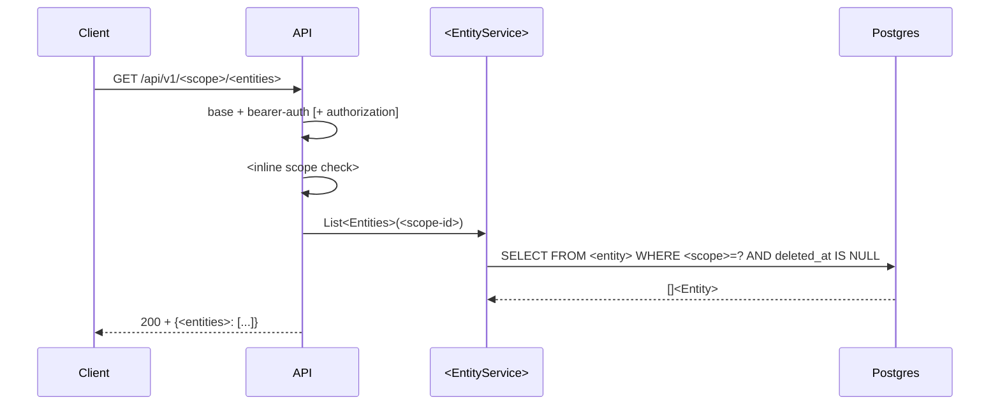
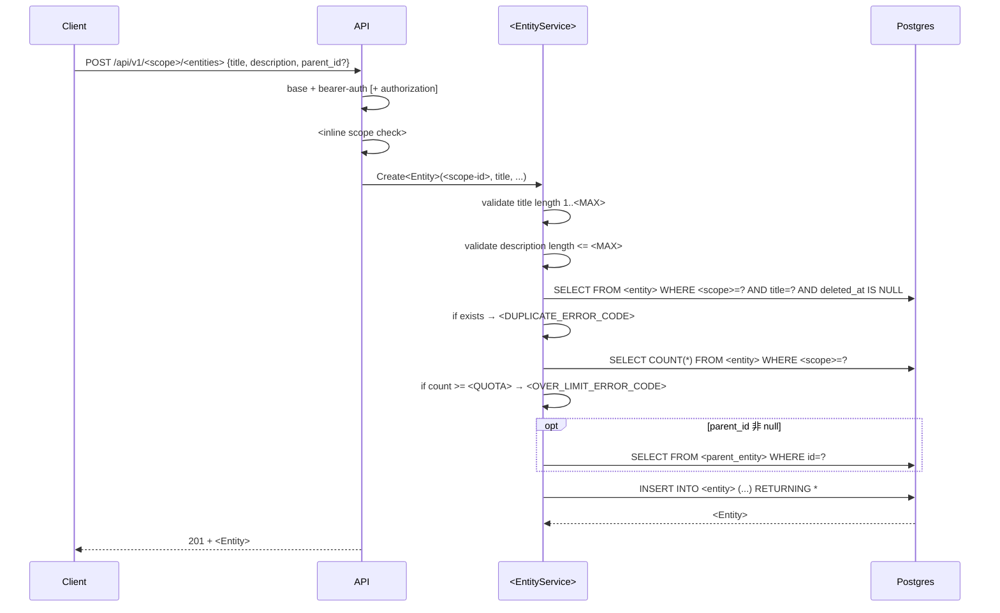
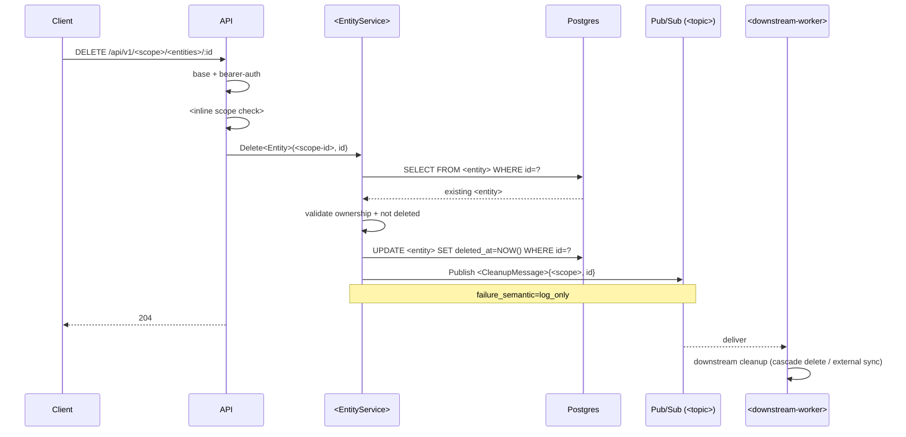

# Manifest Template — 其他 repo 的結構化資料層範本

> 本文件是**可複製的標準範本**。新 repo 要加 manifest 時，依此文件逐節填寫即可。
>
> 配套文件：
> - `manifest-plan.md`：設計原則與 rationale（為什麼這樣設計）
> - `manifest-extraction-guide.md`：每個欄位值**從 repo source code 的哪裡挖出來**（Go / Python / etc）
> - `cartograph/docs/plan.md`：aggregator 端如何消費這份資料
>
> ## 語言中立
>
> 本範本設計為**語言中立**。所有範例以 Go / Gin 為主（repo-b 的技術棧），但 schema 本身不綁 Go：
> - `code_ref` 格式 `<path>#<Symbol>` 通用於任何語言（`app/router.py#create_audio`、`src/routes/user.ts#createUser`）
> - `binary` 欄位在 Python 可寫模組入口（`app.main:app` for uvicorn、`celery -A app.worker worker`）
> - middleware 概念覆蓋 Gin middleware / Django middleware / FastAPI dependencies / Flask before_request
> - 具體語言的 extraction 寫法見 `manifest-extraction-guide.md`

---

## 1. 資料夾結構

每個 source repo 的 manifest 寫在 Cartograph 裡 `data/<repo-id>/` 底下 — source repo 本身不放任何 yaml。

```
$CARTOGRAPH_HOME/data/<repo-id>/
├── service.yaml                      # 頂層索引 + middleware pipelines + env_config + environments
├── apis/
│   └── <id>[.v<n>].yaml              # 每個 HTTP endpoint 一份（含 webhook）；多版本以 .v2 / .v3 後綴
├── workers/
│   └── <id>.yaml                     # 每個 pubsub subscriber / scheduler / cron job 一份
├── tables/
│   └── <id>.yaml                     # 每張 DB table 一份
├── topics/
│   └── <id>.yaml                     # 每個 Pub/Sub topic 一份
├── integrations/
│   └── <id>.yaml                     # 每個第三方整合一份（inbound / outbound / 雙向）
└── middlewares/
    └── <id>.yaml                     # 一等 entity（HTTP middleware；見 §8.5）
```

Sibling 目錄：

- `$CARTOGRAPH_HOME/batch_plan/<repo-id>/` — `cartograph-init` 的產出（batch_plan.md + handover.md），不是 aggregator 的輸入。
- `$CARTOGRAPH_HOME/docs/` — 本範本與 extraction guide 所在處（canonical）。

歷史 repo 若看到 `external_services/` 資料夾，視為 `integrations/` 的舊名 — 統一用 `integrations/`。

---

## 2. 設計原則（精簡版）

1. **單邊宣告**：只寫自己這側做什麼；跨 repo 關係由 aggregator 透過 id 對齊自動 join
2. **一個實體一份檔**：便於 drill-down、change review、選擇性更新
3. **ID 為 join key**：所有 `uses.*` 透過 id 字串對齊
4. **不重複 OpenAPI**：API request/response schema 以 `schema_ref` / `openapi_ref` 指向既有 source
5. **Mermaid 內嵌字串**：`sequence_mermaid:` 直接放 Mermaid 原始碼，不做外部 file ref
6. **方向語意靠欄位，不靠資料夾**：integrations 用 `directions: [inbound, outbound]` 表達方向，不拆資料夾

---

## 3. `service.yaml` — 頂層索引

```yaml
id: <service-id>                      # 全 org 唯一；通常 = repo 短名
repo: <org>/<repo>                    # GitHub path，e.g. your-org/repo-b
team: <owning-team>                   # e.g. platform / growth / messaging
description: <一行描述>
tech:
  - go                                # free-form 技術標籤
  - postgres
  - gcp-pubsub

components:                           # 一個 repo 可能有多個 binary / 啟動入口
  - id: api
    binary: cmd/api                   # Go: cmd/<name>；Python: "uvicorn app.main:app" 或 "app.main:app"
    description: HTTP server
  - id: worker
    binary: cmd/worker                # Python 可寫 "celery -A app.worker worker" 這種啟動命令
    description: Pub/Sub subscriber

# 僅列 id + file，細節在各自檔案
apis:
  - id: health
    file: apis/health.yaml
workers:
  - id: task-processor
    file: workers/task-processor.yaml
tables:
  - id: conversion
    file: tables/conversion.yaml
topics_produced:
  - id: repo-b-tasks
    file: topics/repo-b-tasks.yaml
topics_consumed:
  - id: repo-b-tasks              # self-consume: API 發、worker 收
    file: topics/repo-b-tasks.yaml
integrations:
  - id: gcs
    file: integrations/gcs.yaml
middlewares:                          # middleware 一等 entity（見 §8.5）
  - id: gin-recovery
    file: middlewares/gin-recovery.yaml
  - id: bearer-auth
    file: middlewares/bearer-auth.yaml

depends_on_infra:                     # 抽象依賴類別，用於 repo overview
  - postgres
  - gcp-pubsub
  - gcs
  - secret-manager

middleware_pipelines:                 # 共用 middleware order — 只宣告「組合」（哪幾支 middleware 以什麼順序串）
                                      # middleware 本身的 code_ref / config / error_responses 寫在 middlewares/<id>.yaml
  - id: base
    description: 所有路由皆套用
    order:
      - gin-recovery
      - request-id
      - request-logger
  - id: v1-authenticated
    description: /api/v1/* 在 base 之後再套用
    order:
      - gin-recovery
      - request-id
      - request-logger
      - bearer-auth

env_config:                           # 環境變數總覽 + 使用者
  - key: APP_AUTH_TOKENS
    used_by: [bearer-auth]
    source: secret-manager

environments:                         # 部署實體（不用 {env} pattern，明確列出）
  - id: staging
    gcp_project: shared-resource-staging
    region: asia-east1
    deployment_type: cloud-run          # 選填；cloud-run / gke-helm / gke-raw / k8s-deployment
    api_url_pattern: "https://repo-b-api-staging-*.a.run.app"
    gcs_bucket: repo-b-staging
    cdn_url_prefix: "https://cdn.platform.staging.your-org.com/repo-b/*"

  # --- GKE 部署範例 ---
  # - id: staging
  #   gcp_project: app-staging                            # 本身部署所在 project
  #   shared_resource_project: shared-resource-staging     # Pub/Sub 所在 project（可能與部署 project 不同）
  #   region: asia-east1
  #   deployment_type: gke-helm
  #   api_url: "https://api.app-staging.your-org.com"     # 固定網域（非 Cloud Run *.a.run.app pattern）
  #   cdn_domain: "cdn.app-staging.your-org.com"
  #   db_instance: repo-a-staging                         # Cloud SQL instance 名
  #   redis_instance: repo-a-staging
  #   helm_values_ref: <iac-repo>/argocd/repo-a/staging-values.yaml
  #   argocd_app_ref: <argo-resources-repo>/applications/tw/app-staging/
  #   terraform_ref: <iac-repo>/terraform/app/gcp/configs/staging.tfvars
  #   image_repo: "asia-docker.pkg.dev/your-org/repo-a/staging"
```

### Deployment type 欄位選用

`deployment_type` 選填；aggregator 用來決定渲染哪套 infra link icon。主要決定「API URL 是動態還是固定」與「source-of-truth 在哪」：

| deployment_type | 主欄位 | 備註 |
|---|---|---|
| `cloud-run` | `api_url_pattern` (`*.a.run.app`) | revision 帶 hash；單 project 部署 |
| `gke-helm` | `api_url` + `helm_values_ref` + `argocd_app_ref` | 固定網域；部署與 Pub/Sub 可分 project |
| `gke-raw` | `api_url` + `k8s_manifest_ref` | 固定網域；手動 k8s yaml 管理 |
| `k8s-deployment` | `api_url` | 一般 k8s 部署，非 ArgoCD |

GKE 類型常見的補充欄位（全選填）：
- `shared_resource_project`：Pub/Sub / BigQuery 等共享資源所在 project
- `helm_values_ref` / `argocd_app_ref` / `terraform_ref`：各 source-of-truth 檔案 path
- `db_instance` / `redis_instance` / `cdn_domain`：方便 aggregator 直接渲染 infra link
- `image_repo`：container registry path

欄位命名原則：**Cloud Run-specific 用 `_pattern`（含 wildcard）；固定值用不帶 `_pattern` 的版本**。例如 `api_url_pattern` vs `api_url`，`bucket_pattern` vs `bucket`。

### Components 判斷標準（三個都滿足才算一個）

1. 有自己的 entrypoint（Go 是 `cmd/<name>/main.go`）
2. build 成獨立 binary 或獨立 image tag（共用 image 但不同 `command` 也算）
3. 部署成獨立 runtime（Cloud Run service / worker pool / K8s deployment 等）

反例：同 binary 內的 package、同 process 內的 goroutine、sidecar container 都**不算**。

---

## 4. `apis/<id>.yaml` — HTTP endpoint（含 webhook）

```yaml
id: <unique-within-repo>
version: v1                           # 選填；有多版本時必填
status: active                        # active / deprecated / sunset；選填
deprecated_in: "2026-12-01"           # 選填，搭配 status=deprecated
replaced_by: v2                       # 選填，搭配 status=deprecated
endpoint_type: rest                   # rest / webhook / internal；預設 rest
group: messages                       # 選填；僅在自動推算（見下）錯誤時 override

method: POST
path: /api/v1/audio/convert
component: api                        # join to service.yaml#components[].id
description: <一行>
auth: bearer_token                    # none / bearer_token / webhook-signature / ...
code_ref: internal/router/handler.go#FunctionName
openapi_ref: docs/openapi.yaml#/paths/~1api~1v1~1audio~1convert/post

middleware_pipeline: v1-authenticated
middlewares:
  - id: gin-recovery
  - id: bearer-auth
    code_ref: internal/router/middleware_auth.go#AuthMiddlewareSimple.Required
    config_env: APP_AUTH_TOKENS

inline_auth_checks:                   # 選填；handler 內 inline 的驗證（非 middleware）
  - name: check-scope-in-credential
    code_ref: internal/router/param_util.go#CheckScopeInCredential
    scope: <scope-type>                # 依 service domain 自訂，例如 tenant / project / workspace / channel / resource
    note: "驗 credential 的 scope map；GET 時失敗可回 404，其他 method 回 UNAUTHORIZED"
  - name: validate-sub-resource-level
    code_ref: internal/app/service/<service>/validation_service.go#ValidateCredentialSubResourceLevel
    scope: <sub-scope-type>
    note: "SELECT sub-resource → SELECT 上層 scope → 驗 credential scope；會查 DB"

request:
  content_type: application/json
  schema_ref: internal/router/payload/audio.go#AudioConvertRequest
  # schema_ref 格式支援 inline 類型：
  #   <file>#<Symbol>                     payload package 頂層型別
  #   <file>#<OuterFunc>.<InnerType>      handler 內 inline 定義的 struct（見 §4.5）
  path_params:                        # 選填
    - name: id
      type: int64
      required: true
  headers_optional:                   # 選填
    - name: X-Request-ID
      max_length: 128
  fields:                             # 選填
    - name: source_url
      type: string
      required: true
      validation: "http/https URL"
    - name: source_type
      type: string
      required: true
      enum: [audio/webm, audio/mp4]

response:                             # 每個 status 一筆
  - status: 201
    schema_ref: internal/router/payload/audio.go#AudioConvertResponse
    fields:                           # 選填；對稱 request.fields[]
      - name: id
        type: int64
        description: DB row id
      - name: status
        type: string
        enum: [pending, processing, completed, failed]
      - name: result_url
        type: string
        nullable: true                # pointer / Optional / null-able field 標 true
        description: "status=completed 才有值"
  - status: 400
    error_code: PARAMETER_INVALID
    note: "id 無法 parse 成 int64"     # 選填，解釋特定情境
  - status: 401
    error_code: AUTH_NOT_AUTHENTICATED
  - status: 500
    body: empty                       # 選填；若 response 無 body 可標 body: empty
    note: "panic recovery 時回傳"

steps:                                # handler 內部順序；每 step 可有的欄位（全選填除了 order / action）：
  - order: 1                          # int，遞增
    action: bind_json_body            # 動詞片語命名
    code_ref: internal/router/handler.go#Fn
  - order: 2
    action: validate_source_url
    rule: "scheme 限 http/https，host 非空"     # 業務規則描述
    code_ref: internal/app/service/conversion_service.go#validate
  - order: 3
    action: insert_row
    target: table:conversion          # 格式：<kind>:<id>；kind ∈ table / topic / integration / worker
    note: "status='pending', type='audio_convert'"
  - order: 4
    action: publish
    target: topic:repo-b-tasks
    schema: TaskMessage               # message struct / class 名
  - order: 5
    action: update_status
    target: table:conversion
    to: completed                     # status transition 的目標狀態
  - order: 6
    action: upload_file
    target: integration:gcs
    path: "audio/converted/{name}{ext}"   # 實際資源路徑（含模板變數）
  - order: 7
    action: ffprobe_source
    target: integration:ffmpeg
    optional: true                    # 這步失敗不中斷流程（舊欄位；保留相容）
    failure_semantic: best_effort     # 選填；block / best_effort / log_only
    # optional 與 failure_semantic 的關係：
    #   optional: true  ≈  failure_semantic: best_effort（失敗不中斷、不算錯）
    #   但 failure_semantic 更細：
    #     block       — 失敗必中斷主流程（預設）
    #     best_effort — 失敗 log 後繼續；結果影響後續但不 fatal
    #     log_only    — fire-and-forget；失敗只記 log，不影響任何後續
  - order: 8
    action: respond
    body: AudioConvertResponse        # response body struct / class 名
    status: 201                       # 對應 response[].status
  - order: 9
    action: cleanup_temp_workdir
    note: "defer / finally 清暫存"

### 所有 step 欄位總表

| 欄位 | 必要 | 類型 | 用途 | 範例 |
|---|---|---|---|---|
| `order` | ✓ | int | 步驟序號（遞增，從 1 起算；決定 timeline 排序） | `1` |
| `action` | ✓ | string | 動詞片語描述這步做什麼（snake_case 慣例） | `bind_json_body` / `insert_row` / `publish` / `respond` |
| `target` |  | string | 碰到的實體，格式 `<kind>:<id>`；kind ∈ `table` / `topic` / `integration` / `worker`；aggregator 會渲染成該 entity detail 頁的連結 | `table:organization` / `topic:audit-events` / `integration:cdp-server` / `worker:task-processor` |
| `code_ref` |  | string | 此步實作位置（通常是 service / repository 層的 function）；`<file>#<Symbol>` 格式 | `internal/app/service/org_service.go#CreateOrg` |
| `rule` |  | string | 業務規則、SQL 片段、validation 描述 | `"WHERE tenant_id = ? AND deleted_at IS NULL"` / `"scheme 限 http/https，host 非空"` |
| `schema` |  | string | publish / unmarshal 時的 message struct / class 名 | `TaskMessage` / `AuditLog` |
| `body` |  | string | response body 型別名（搭配 `action: respond`） | `AudioConvertResponse` / `Tag` |
| `status` |  | int \| string | HTTP status code（搭配 `action: respond`；對應 `response[].status`） | `200` / `201` / `204` |
| `to` |  | string | status transition 的目標值（搭配 `action: update_status`） | `completed` / `failed` / `processing` |
| `path` |  | string | 實際資源路徑，支援 `{var}` 模板變數（搭配 `action: upload_file` 等） | `"audio/converted/{name}{ext}"` |
| `note` |  | string | free-form 補充；記 known quirk、非直覺行為、旁註 | `"publish 失敗僅 log，不影響 API 回應"` |
| `optional` |  | bool | 此步失敗不中斷主流程（舊欄位；建議改用 `failure_semantic`） | `true` |
| `failure_semantic` |  | enum | 失敗行為三級：`block` / `best_effort` / `log_only` | `best_effort` |
| `target_api_ref` |  | string | 跨 repo 呼叫目標 API（composite `<repo>:<api-id>`；見 §9） | `"repo-b:audio-convert"` |

**`action` 命名慣例**（不強制，但保持跨 repo 一致對 aggregator drill-down 體驗更好）：

| Pattern | 意義 | 常搭配欄位 |
|---|---|---|
| `bind_json_body` / `parse_path_param` | input 解析 | `schema` / `note` |
| `validate_<thing>` | 輸入 / 業務驗證 | `rule` / `code_ref` |
| `get_<resource>_by_<key>` / `list_<resource>` | DB 讀 | `target: table:*` / `rule` |
| `insert_row` / `update_row` / `delete_row` | DB 寫 | `target: table:*` / `rule` |
| `update_status` / `set_<field>` | DB 狀態轉換 | `target: table:*` / `to` |
| `publish` | Pub/Sub 發訊息 | `target: topic:*` / `schema` / `failure_semantic` |
| `upload_file` / `download_file` | 物件儲存 | `target: integration:gcs` / `path` |
| `call_<operation>` / `sync_<thing>_to_<system>` | 外部 HTTP / cross-service sync | `target: integration:*` / `failure_semantic` |
| `send_metric_event` / `log_<event>` | Cloud Logging sink / metric | `target: log_sink:*` / `schema` |
| `respond` | HTTP 回應 | `body` / `status` |
| `return_error` / `abort` | 早退 | `status` / `note` |

**失敗行為**：`optional: true` ≈ `failure_semantic: best_effort`（兩者並存時以 `failure_semantic` 為準）：

| `failure_semantic` | 行為 | 典型情境 |
|---|---|---|
| `block`（預設可省略） | 失敗必中斷主流程，呼叫方收錯 | DB 寫入、主要外部 API call、CDP 同步 |
| `best_effort` | 失敗 log 後繼續；結果影響後續但不 fatal | optional enrichment、次要資料查詢 |
| `log_only` | fire-and-forget，呼叫方無視結果 | metric event、engagement event |

uses:                                 # 去重摘要；id 必須存在對應 yaml
  tables: [conversion]
  topics_produced: [repo-b-tasks]
  topics_consumed: []
  integrations: []
  workers_triggered: [task-processor]
  log_sinks_produced: []              # 選填；Cloud Logging sink / stdout-based event routing
                                      #（非 Pub/Sub 的「事件外送」，例如 zerolog 寫 "cloud_logging_sink" 欄位）

sequence_mermaid: |                   # 必填（2026-04 規則收斂）；整條流程
  sequenceDiagram
    participant C as Client
    participant A as API
    C->>A: POST /api/v1/...
    ...
```

### Sequence diagram 記錄原則（強制 — spec requirement）

`sequence_mermaid` 是 **required field**。每支 API / worker yaml 都必須提供可 render 的 Mermaid `sequenceDiagram` 原始碼，即使流程極短（單 DB 讀 + respond）也要寫。aggregator 端 Zod schema 會擋空值。

**Participant 骨架**（依實際會碰到的實體取捨，不用全列）：

| 縮寫 | 對應 | 何時列 |
|---|---|---|
| `C` Client | 外部呼叫方 | 所有 API |
| `A` API (gin/framework) | HTTP handler | 所有 API |
| `S` <ServiceName> | application service 層 | handler 有呼叫 service 時 |
| `DB` Postgres / MySQL | 關聯式 DB | 有 DB 讀寫時 |
| `R` Redis | cache / lock / counter | 有 Redis 操作時 |
| `PS` Pub/Sub (topic-name) | Pub/Sub broker | 有 publish 時 |
| `W` worker-id | 後續 worker | publish 後下游有 worker 消費時（用 dashed arrow） |
| `X` <integration-name> | 外部 / 跨 repo HTTP | 有 outbound call 時 |
| `ES` Elasticsearch | 搜尋 | 走 ES 查詢時 |
| `BQ` BigQuery | 查詢 / 匯入 | 走 BigQuery 時 |
| `GCS` Cloud Storage | 檔案物件 | 有 upload/download 時 |

**兩個 arrow 類型的規則對應 `steps[]`**

| Arrow 類型 | 對應 step 類型 | 範例 |
|---|---|---|
| `C->>A: METHOD /path` | HTTP request（對應 steps 起始，隱含 `parse_path_param` / `bind_json_body` / `get_credential` 等 plumbing） | `C->>A: POST /api/v1/<scope>/<entities>` |
| `A->>A: <middleware chain>` | 整條 middleware pipeline 合成 **一行** | `A->>A: base + bearer-auth + acl` |
| `A->>A: <inline check>` | 每個 `inline_auth_checks[]` 一行 | `A->>A: CheckScopeInCredential(<scope-id>)` |
| `A->>S: <ServiceMethod>(...)` | handler 呼 service | `A->>S: Create<Entity>(<scope-id>, title, parentID)` |
| `S->>S: <validation>` | service-layer business validation | `S->>S: validate title length 1..20` |
| `S->>DB: SELECT / INSERT / UPDATE ...` | DB read / write step | `S->>DB: SELECT COUNT(*) FROM <entity> WHERE <scope>=?` |
| `DB-->>S: <result>` | DB 回傳（簡短） | `DB-->>S: existing <entity>` |
| `S->>X: <operation>` | external / cross-service call | `S->>X: GetBillingFeature(feature_code)` |
| `X-->>S: <result>` | external response | `X-->>S: Quota{balance, usage}` |
| `S->>PS: Publish <Schema>{...}` | publish step | `S->>PS: Publish <MessageStruct>{...}` |
| `Note over ...: failure_semantic=<X>` | publish / external 失敗行為標註 | `Note over S,PS: failure_semantic=log_only` |
| `PS-->>W: deliver` | worker 非同步消費（**dashed**） | `PS-->>W: deliver` |
| `A-->>C: <status> + <body>` | HTTP response（隱含 `respond` step） | `A-->>C: 201 + <ResponseBody>` |
| `alt` / `else` | 有分支（成功 vs 失敗、feature flag 不同分支） | 見下方「幾個典型長相」 |

**可省略（plumbing；已隱含在 C→A 的 request 行或 A→C 的 response 行）**

- `parse_path_param` / `parse_path_params` / `parse_query_params`
- `bind_json_body` / `bind_query_params`（**若僅是 plumbing**；若欄位驗證是重點就要獨立 arrow）
- `get_credential` / `get_user_info_from_context`
- `marshal_metadata` / `compose_payload` 等組資料動作（可合併成下一個真實 arrow 的 payload 附註）
- `respond`（已隱含在 A-->>C）

**必須獨立 arrow（不准合併）**

- 每個 **middleware 層** vs **handler inline check** vs **service layer validation** 必須分別畫（**跨層級不合併**）
  - ✅ `A->>A: base + bearer-auth` + `A->>A: <inline scope check>`
  - ❌ `A->>A: base + bearer-auth + inline scope check`（跨層級合併，讀者無法分辨執行時機）
- 每個 business rule validation 有獨立錯誤分支意義的（quota / duplicate / ownership / format）
- 每個 DB read / write（含簡短 SQL 條件）
- 每個 publish / external call（含 failure_semantic Note）
- 每個 status transition
- 同一 handler 若觸發多個不同 event type（共用一個 topic 但以 attribute 區分），**每種 event type 獨立一個 arrow**，不合併

**簡短 validation 的合併例外**：同層級、單一分支、無獨立錯誤語意的驗證，可合併：
```
A->>A: bind body & validate <field> format
```
（兩個都是 handler 層輸入處理，且驗證失敗 = 400 PARAMETER_INVALID，不是獨立業務錯誤碼。）

**DB arrow 的 SQL 粒度規則**：SQL 片段**只在查詢語意影響讀者理解時才寫**，否則一律用 action-phrase（精簡）。

| 情境 | 寫法 | 理由 |
|---|---|---|
| 單筆 get by id | `S->>DB: get <entity> by id` | 查詢 shape 無懸念 |
| 單純 list | `S->>DB: list <entities> by <scope>` | 同上 |
| Count | `S->>DB: count <entity> by <scope>` | 同上 |
| 單欄 update 寫回 | `S->>DB: update <entity> <field>` | 同上 |
| **soft-delete filter** | `S->>DB: SELECT FROM <entity> WHERE <scope>=? AND deleted_at IS NULL` | `deleted_at IS NULL` 是讀者需要看到的語意（會影響結果對不對） |
| **JOIN 有業務意義** | `S->>DB: SELECT <a>.* FROM <join-table> JOIN <a> WHERE <fk>=?` | JOIN 哪張表、為什麼 JOIN 是關鍵資訊，action-phrase 會丟 |
| **UPSERT / ON CONFLICT** | `S->>DB: UPSERT INTO <entity> (...) ON CONFLICT <action>` | reactivate / do-nothing / do-update 的語意必顯式 |
| **partial unique index 查 dup** | `S->>DB: SELECT FROM <entity> WHERE <scope>=? AND <field>=? AND deleted_at IS NULL` | duplicate 檢查要明確排除 soft-deleted（否則讀者會以為重複就不能復活） |
| **soft-delete 寫回** | `S->>DB: UPDATE <entity> SET deleted_at=NOW() WHERE id=?` | 標示是 soft-delete 不是 hard-delete |
| **cursor / 特殊排序** | `S->>DB: list <entity> by <scope> ORDER BY created_at DESC, id DESC` | cursor-based 分頁的排序順序是關鍵 |
| **subquery / CTE / window** | 保留 SQL 片段 | 查詢結構本身是核心邏輯 |

**反例**（不該寫 SQL 的）：
- ❌ `S->>DB: SELECT FROM <entity> WHERE id=?` → ✅ `S->>DB: get <entity> by id`
- ❌ `S->>DB: INSERT INTO <entity> (...) RETURNING *` → ✅ `S->>DB: insert <entity>`（除非 RETURNING 欄位對下游流程有影響）
- ❌ `S->>DB: UPDATE <entity> SET <field>=? WHERE id=?` → ✅ `S->>DB: update <entity> <field>`
- ❌ `S->>DB: SELECT COUNT(*) FROM ...` → ✅ `S->>DB: count <entity>`

**判斷問句**：「如果把 SQL 片段換成 5 個字的 action-phrase，讀者會不會遺漏什麼？」
- 會遺漏 → 保留 SQL
- 不會 → action-phrase

**失敗分支 / 條件分支用 `alt` / `else` 呈現**（必要時才用）：
```
alt external 回 2xx
  X-->>S: Response (id, status=pending, ...)
  A-->>C: 201 + {...}
else external 失敗
  X-->>S: non-2xx / network error
  A-->>C: 502 REMOTE_PROCESS
end
```

**幾個典型長相**（命名刻意抽象；實際 repo yaml 請以該 service 的領域名稱取代）

純 read（list / get / count）4-6 行：


CRUD create（有多重驗證 + quota）10-15 行：


有 publish + worker 鏈：


---

### Pub/Sub / event 記錄原則（強制 — spec requirement）

Pub/Sub event 是跨 service 的**業務訊號**，下游系統（other repos / BigQuery warehouse / dashboard / billing / AI usage accounting）全部依賴這些事件做 aggregation 與 action。**漏記 = 下游不知道上游做了什麼**。

**規則**：任何 API / worker / job 只要有**對外發事件**的呼叫（任一 Pub/Sub topic 的 publish、任一 `*EventBroker.Submit*` / `SubmitAuditLog` / `SendMetricEvent` 或等價的 broker 抽象），必須**同時**在三處記錄：

| 位置 | 要寫什麼 |
|---|---|
| `apis/<id>.yaml` 或 `workers/<id>.yaml` 的 `steps[]` 裡一個 step | `action: publish` / `submit_<event>_event`；`target: topic:<topic-id>`；`schema: <MessageStructName>`；若 publish 失敗僅 log 要標 `failure_semantic: log_only` |
| 同檔 `uses.topics_produced[]`（或 `log_sinks_produced[]` 若非 Pub/Sub） | 該 topic / sink 的 id |
| `topics/<topic-id>.yaml`（或 `integrations/<sink-id>.yaml` kind=cloud-logging-sink） | 檔必須存在；`message_schema.fields[]` 列出事件欄位；共用 topic 分多種 event type（常見模式：用 `type` attribute 區分，例如 `entity_updated` / `notification_sent` / `billing_metered`），必須在 `attributes[]` 或 `message_schema.fields[].enum` 列出所有變體 |

**不可以省略的情境**：
- publish 失敗只 log（`failure_semantic: log_only`）——即使不影響 API 回應，下游仍依賴此事件，必須記錄
- 單一 handler 觸發多個不同 event type（例如建立實體 + 送通知 + billing 計費 3 個共用 topic 的 event），**每個 event type 各列一個 step**，不合併
- Worker 消費一個 event 再 publish 下一個（鏈式事件），上下兩個 publish 都要寫
- `go broker.SubmitEvent(...)` fire-and-forget 也要記（仍是對外 side-effect）
- 錯誤 / 失敗分支裡的 publish（例如 handler 在 DB update 失敗時仍送 audit event）

**最容易漏寫的來源**：
- Service layer helper function 內部 publish——grep 必須追到最內層 broker call
- `defer` / `finally` 區塊裡的 publish
- 多個 event type 共用同一個 topic 的情境（常見 fan-in business-event topic），grep `topic.Publish` 只看到「一個 topic」，但實際上是**多種 event**，需額外從 attribute / message payload 辨識

**跨 repo 影響**：當別的 repo 的 aggregator 想列出「誰是這個 topic 的 producer」，它**只能**從各 repo 的 manifest `topics_produced` 反向 join。這邊沒寫 = 跨 repo graph 會缺一條邊。

### API 版本化規則

- **檔名**：`<id>.v<n>.yaml`（e.g. `send-message.v2.yaml`）
- **Composite key**：`(id, version)` —— 同 id 可有多個 version 各自一檔
- **version 欄位**：`v1` / `v2` / `v3`（單純 tag，不解析）
- **status**：`active` / `deprecated` / `sunset`
- **deprecated_in / replaced_by**：deprecation 時間與後續版本 id，UI 可渲染遷移 hint
- **只有單版本的 API 可省略 `version` 欄位**
- **同 id 多版本並存時，所有版本都必填 `version`**（aggregator 用 `version` 欄位做 composite key 的第二段；缺 version 會被 `groupApisByBaseId` 視為「最舊版」，跟其他明列版本的 API 混在同 id 底下會判斷錯）

### Aggregator UI 對多 version 的行為

aggregator 原生支援同一個 base id 下多 version 並存；manifest 作者按上節規則填即可，不需要自己合 yaml：

| 場景 | URL / 顯示 |
|---|---|
| list page | 每個 base id 只出現**一張卡**，以最新版的 path/description 顯示；badges 列出所有存在的 version tag |
| detail page 預設 | `/repos/<repo>/apis/<id>` — 不帶 query 時顯示**最新版** |
| detail page 切版 | 右上角 `Version` 下拉選單切換；選非最新版後 URL 變 `/repos/<repo>/apis/<id>?version=v1` |
| 切回最新 | switcher 會自動把 `?version=` 從 query 移除，保持 canonical URL 乾淨 |
| 跨 repo `target_api_ref: <repo>:<id>` | 解析到最新版（暫未支援 `@v<n>` 後綴；若要指到特定版本，aggregator 一側要另加解析器） |
| 排序 | `v<n>` 以 N 數字遞減；無 `version` 欄位視為最舊 |
| filter / search | 只要「任一版本」符合條件，整個 base id 就保留在 list 上（不會出現只剩半邊版本的殘影） |
| sidebar | 一樣以 base id 去重；meta 欄把所有版本 tag 並列（如 `v2/v1`） |

實作位置：`src/lib/loader.ts#groupApisByBaseId` / `pickApiVersion`、`src/lib/sidebar.ts#buildSidebar`、`src/components/ApiVersionSwitcher.tsx`、list page `src/app/repos/[repo]/apis/page.tsx`、detail page `src/app/repos/[repo]/apis/[api]/page.tsx`。

### API `group` 自動推算規則

aggregator 會自動從 `path` 算出 group name 放進 sidebar / list page 的分群標題，**大部分情況下 manifest 不需要寫 `group` 欄位**。

| `path` | 自動 group | 備註 |
|---|---|---|
| `/api/v1/messages/send` | `messages` | 一般單層 |
| `/api/v2/users/:id` | `users` | 單層，path param 結尾 |
| `/api/v1/tenants/:tenant_id/items/itemA` | `tenants/items` | 2 層（多租戶下有很多子資源時展開） |
| `/api/v1/projects/:project_id/modules/module-x` | `projects/modules` | 同上 |
| `/api/v1/tenants/:tenant_id/settings/:code` | `tenants/settings` | 同上 |
| `/webhook/<provider>` | `webhook` | 非 `/api/vN` 開頭 |

規則（aggregator 程式碼實作於 `cartograph/src/lib/sidebar.ts#apiGroupName`）：
1. 若 yaml 有手寫 `group:` 直接用
2. `/api/vN/<A>/<param>/<B>/...` 且第二段是 path param（`:xxx` / `{xxx}` / 純數字）→ 回 `A/B`（2 層）
3. `/api/vN/<A>/...` → 回 `A`
4. 非 `/api/vN/` 開頭 → 回 path 第一段
5. 全失敗 → `misc`

**為什麼加 2 層 rule**：多租戶 / 多專案型 service 底下 `/api/v1/<scope>/:<scope-id>/*` 常有上百支 endpoint；全部擠進單一 `<scope>` 一層會很難瀏覽。code 端本來就用 sub-group（`v1.Group("/<scope>/:<scope-id>/<sub>", ...)`）組織，manifest 的 sidebar 分群對齊這個結構比較直觀。

**何時需要手寫 `group:`**：自動推算結果語意錯誤時 override。例如 `/api/internal/auth/verify` 自動會歸 `internal`，但語意屬 `auth`；或想把 `tenants/module-x` 平成 `module-x`。


### 4.5 `schema_ref` 支援 handler-inline 定義的型別

Go / Python handler 內常出現 inline 定義的 response / body struct（不在 payload package）：

```go
func ListTags(app *app.Application) gin.HandlerFunc {
    type ResponseTag struct { ... }       // inline 型別
    type Response struct { Tags []ResponseTag `json:"tags"` }
    return func(c *gin.Context) { ... }
}
```

`schema_ref` 欄位格式支援兩種寫法：

| 格式 | 範例 | 對應 |
|---|---|---|
| `<file>#<Symbol>` | `internal/router/payload/<entity>.go#<Entity>` | payload package 頂層型別 |
| `<file>#<OuterFunc>.<InnerType>` | `internal/router/handler_<entity>.go#List<Entities>.Response` | handler function 內 inline 定義 |

aggregator 解析時按 `.` split 第一段當外層 symbol，第二段當 inner type。若 inner 型別只是 struct literal（沒名字），退回用 `<OuterFunc>.__inline_response__` 類似慣用命名。

### Webhook 端點特化

Webhook 也寫在 `apis/<id>.yaml`，用 `endpoint_type: webhook` 區分：

```yaml
id: webhook-<provider>-event
endpoint_type: webhook
method: POST
path: /webhook/<provider>
auth: webhook-signature
signature_header: <Provider-Signature-Header>      # 選填
verification_token_env: <PROVIDER>_VERIFY_TOKEN    # 選填；驗證 URL 時用
code_ref: app/webhooks/<provider>.py#handle_event  # Python 也是 path#Symbol
middleware_pipeline: webhook-base
...
```

Webhook 通常跟 outbound 的整合同 provider（e.g. 某訊息平台接收事件 + 回送訊息），兩邊在 `integrations/<provider>.yaml` 裡串起來（`inbound.webhook_endpoints: [webhook-<provider>-event]`）。

### 所有 API 欄位總表

| 欄位 | 必要 | 類型 | 範例 / 說明 |
|---|---|---|---|
| `id` | ✓ | string | repo 內唯一 |
| `version` |  | string | `v1` / `v2`；單版本可省 |
| `status` |  | enum | `active` / `deprecated` / `sunset` |
| `deprecated_in` |  | string (date) | `"2026-12-01"` |
| `replaced_by` |  | string | 後續版本 id |
| `endpoint_type` |  | enum | `rest` (default) / `webhook` / `internal` |
| `group` |  | string | 通常自動推；僅 override 時寫 |
| `method` | ✓ | enum | `GET` / `POST` / `PUT` / `PATCH` / `DELETE` |
| `path` | ✓ | string | `/api/v1/...` |
| `component` | ✓ | string | 指回 `service.yaml#components[].id` |
| `description` | ✓ | string | 一行 |
| `auth` | ✓ | string | `none` / `bearer_token` / `webhook-signature` / ... |
| `code_ref` | ✓ | string | `<path>#<Symbol>` |
| `openapi_ref` |  | string | OpenAPI JSON pointer |
| `middleware_pipeline` | ✓ | string | 指回 `service.yaml#middleware_pipelines[].id` |
| `middlewares[]` | ✓ | list | 每項含 `id` + 選填 `code_ref` / `config_env` / `note` |
| `inline_auth_checks[]` |  | list | 每項含 `name` / `code_ref` / `scope` / `note`；handler 或 service layer 的 inline 驗證（非 middleware） |
| `request` |  | map | `content_type` / `schema_ref` / `path_params[]` / `headers_optional[]` / `fields[]` / `body` |
| `response[]` | ✓ | list | 每項含 `status` + 選填 `schema_ref` / `body` / `error_code` / `note` / `fields[]`（`fields[].{ name, type, nullable?, enum?, description? }`；對稱 `request.fields[]`） |
| `steps[]` |  | list | 見上方 step 所有欄位；可為空 `[]`；每 step 可加 `failure_semantic` / `optional` 表達失敗行為 |
| `uses` | ✓ | map | 六個 key: `tables` / `topics_produced` / `topics_consumed` / `integrations` / `workers_triggered` / `log_sinks_produced` |
| `sequence_mermaid` | ✓ | string | 完整 Mermaid `sequenceDiagram` 原始碼；2026-04 規則收斂為必填，詳見上方「Sequence diagram 記錄原則」 |
| `signature_header`（webhook） |  | string | 驗證用 header 名（各 provider 不同，例：`X-Provider-Signature-256`） |
| `verification_token_env`（webhook） |  | string | 驗證 URL 用的 env var name |

---

## 5. `workers/<id>.yaml` — Pub/Sub subscriber / scheduler / cron

```yaml
id: <unique-within-repo>
kind: pubsub-subscriber               # pubsub-subscriber / cloud-tasks-worker / scheduler / cron；預設 pubsub-subscriber
component: worker
description: <一行>
binary: cmd/worker
code_ref: internal/worker/handler.go#Handle

# ---- 以下視 kind 而定 ----

# kind=pubsub-subscriber：
subscribes_topic: repo-b-tasks
subscription_pattern: "{env}-repo-b-worker-subscription"
subscription_env: APP_PUBSUB_SUBSCRIPTION
receive_settings:
  max_outstanding_messages: 5
  max_extension: 30m

# kind=scheduler / cron：
schedule: "0 */15 * * *"              # cron expression
trigger: cloud-scheduler              # cloud-scheduler / k8s-cronjob / gcp-workflow
# （沒有 subscribes_topic / receive_settings）

# ---- 通用 ----
processors:                           # dispatch 用；可標記 not_implemented
  - id: audio-convert
    conversion_type: audio_convert    # 選填；dispatcher 用哪個 key 決定 dispatch 去哪（各 repo 命名不同）
    code_ref: internal/worker/processor_audio_convert.go#AudioConvertProcessor
  - id: audio-transcribe
    conversion_type: audio_transcribe
    status: not_implemented            # 預留未實作

idempotency:
  strategy: status-check
  rule: "僅處理 status='pending'"
  code_ref: ...

ack_semantics:
  ack_on: [success, application_failure_recorded_in_db]
  nack_on: [db_update_failed]

steps:                                # 欄位與 apis.steps[] 完全同 schema
  - order: 1
    action: unmarshal
    schema: TaskMessage
  - order: 2
    action: select_by_id
    target: table:conversion
  - order: 3
    action: idempotency_check
    rule: skip_if_status_not_pending
  - order: 4
    action: update_status
    target: table:conversion
    to: processing

failure_handling:                     # 失敗時動作序列；結構自由但建議 key 為描述性
  on_processor_error:
    - action: update_status
      target: table:conversion
      to: failed
    - action: set_error_message
    - action: publish_result
      target: topic:repo-b-results
      note: "best-effort; 失敗僅 log"
    - action: return_nil_to_ack       # 明示：避免 infinite Nack 迴圈

uses:
  tables: [conversion]
  topics_produced: [repo-b-results]
  topics_consumed: [repo-b-tasks]
  integrations: [gcs, ffmpeg]

sequence_mermaid: |
  ...
```

### 所有 Worker 欄位總表

| 欄位 | 必要 | 類型 | 範例 / 說明 |
|---|---|---|---|
| `id` | ✓ | string | repo 內唯一 |
| `kind` |  | enum | `pubsub-subscriber`(default) / `scheduler` / `cron` / `cloud-tasks-worker` |
| `component` | ✓ | string | 指回 `service.yaml#components[].id` |
| `description` | ✓ | string | 一行 |
| `binary` |  | string | 啟動命令 |
| `code_ref` |  | string | handler 進入點 |
| `subscribes_topic` |  (pubsub) | string | 指回 `topics/<id>.yaml#id` |
| `subscription_pattern` |  | string | 可含 `{env}` |
| `subscription_env` |  | string | env var name |
| `receive_settings` |  | map | 自由 key/value（多為 Pub/Sub client 設定） |
| `schedule` |  (cron) | string | cron expression |
| `trigger` |  | string | `cloud-scheduler` / `k8s-cronjob` / ... |
| `processors[]` |  | list | `{ id, conversion_type?, code_ref?, status? }` |
| `idempotency` |  | map | `{ strategy?, rule?, code_ref? }` |
| `ack_semantics` |  | map | `{ ack_on: [..], nack_on: [..] }` |
| `steps[]` |  | list | 同 apis.steps schema |
| `failure_handling` |  | map | 自由結構；建議動作序列 |
| `uses` | ✓ | map | 同 apis.uses |
| `sequence_mermaid` | ✓ | string | Mermaid `sequenceDiagram` 原始碼（與 API 同規則，見 §4）；worker 處理流程也必填 |

---

## 6. `tables/<id>.yaml` — DB table

```yaml
id: <table-name>                      # 通常 = DB table 名
database: postgres
description: <一行>
migration_ref: migrations/001_create_x.up.sql
model_code_ref: internal/domain/x.go#X
repo_code_ref: internal/adapter/repository/postgres/x_repo.go
group: user                           # 選填；預設從 id 底線前綴自動推（user_profile → user）

columns:
  - name: id                          # 欄位名（DB 實際 column 名）
    type: BIGSERIAL                   # DB type 字面原樣（含大寫、長度等）
    primary_key: true                 # 選填 bool
    description: 自動遞增 ID            # 選填
  - name: status
    type: TEXT
    nullable: false                   # 選填 bool；省略視為未知
    default: "'pending'"              # 選填；字串原樣（含引號）
    enum: [pending, processing, completed, failed]    # 選填；DB constraint 或應用層約束
    description: "任務狀態"
  - name: created_at
    type: TIMESTAMPTZ
    nullable: false
    default: NOW()

indexes:
  - name: pk_x                        # DB index 名稱
    columns: [id]                     # 涵蓋的欄位（順序重要）
    unique: true                      # 選填
    type: primary_key                 # 選填：primary_key / btree / gin / unique / ...
  - name: idx_x_caller_correlation
    columns: [caller, correlation_id]
    unique: false

# 反向索引：誰讀、誰寫；aggregator 可核對與 apis/*.uses.tables 的一致性
read_by:
  apis: [get-x, retry-x]
  workers: [x-processor]
write_by:
  apis: [create-x]
  workers: [x-processor]
```

### 所有 Table 欄位總表

| 欄位 | 必要 | 類型 | 範例 / 說明 |
|---|---|---|---|
| `id` | ✓ | string | 通常 = DB table 名 |
| `database` | ✓ | string | `postgres` / `mysql` / `clickhouse` / ... |
| `description` |  | string | 一行 |
| `migration_ref` |  | string | migration 檔 path |
| `model_code_ref` |  | string | ORM model / struct / class 定義位置 |
| `repo_code_ref` |  | string | repository pattern 的實作位置 |
| `group` |  | string | 通常自動推；僅 override 時寫 |
| `columns[]` | ✓ | list | 每項 `{ name, type, primary_key?, nullable?, default?, enum?, description? }` |
| `indexes[]` |  | list | 每項 `{ name, columns[], unique?, type? }` |
| `read_by` |  | map | `{ apis: [...], workers: [...] }` |
| `write_by` |  | map | 同上 |

---

## 7. `topics/<id>.yaml` — Pub/Sub topic

```yaml
id: <topic-name>                      # 全 org 唯一
provider: gcp-pubsub                  # gcp-pubsub / kafka / nats / ...
gcp_project_pattern: shared-resource-{env}   # hint；真相看 service.yaml#environments
description: <一行>
schema_ref: internal/adapter/eventbroker/publisher.go#Message
publisher_code_ref: ...
consumer_code_ref: ...

message_schema:
  fields:
    - name: conversion_id
      type: int64                     # 語言中立 type 名；Go int64 / Python int 都對應
      required: true
      description: "DB row id"
    - name: status
      type: string
      enum: [completed, failed]        # 選填；限定值
    - name: result_url
      type: string
      nullable: true                   # 選填 bool
      description: "status=completed 才有"

attributes:                           # Pub/Sub 的 attribute（不屬 message body）
  - name: type
    type: string
    description: ConversionType
  - name: status
    type: string

# 本 repo 內的 producer / consumer（item shape 取決於實體類型）
produced_by:
  - api: audio-convert                # { api: <api-id> }
  - api: retry-conversion
  - worker: some-worker               # { worker: <worker-id> } 也可以
consumed_by:
  - worker: task-processor
    subscription: "{env}-repo-b-worker-subscription"
  # 若本 repo 無 consumer，留空 list：consumed_by: []

# 跨 repo 消費者 hint（aggregator Phase 2 會自動 join 覆蓋；Phase 1 只作 UI hint）
known_external_consumers:
  - repo: your-org/repo-a
    note: "從 terraform subscription 命名 {env}-repo-b-results-repo-a-subscription 推得"

retry_policy:                         # 結構自由，通常為 client-side settings
  max_outstanding_messages: 5
  max_extension: 30m
  note: "實際 retry 策略由 cloud provider 管"

delivery_guarantee: at-least-once     # at-least-once / at-most-once / exactly-once
```

### 所有 Topic 欄位總表

| 欄位 | 必要 | 類型 | 範例 / 說明 |
|---|---|---|---|
| `id` | ✓ | string | 全 org 唯一（topic name） |
| `provider` | ✓ | string | `gcp-pubsub` / `kafka` / `nats` / ... |
| `gcp_project_pattern` |  | string | hint；真相看 `service.yaml#environments` |
| `description` |  | string | 一行 |
| `schema_ref` |  | string | message struct / class 定義位置 |
| `publisher_code_ref` |  | string | 發布方 code ref |
| `consumer_code_ref` |  | string | 消費方 code ref |
| `message_schema` |  | map | `{ fields: [{name, type, required?, nullable?, enum?, description?}] }` |
| `attributes[]` |  | list | 每項 `{ name, type?, description? }` |
| `produced_by[]` |  | list | item shape 自由（通常 `{api: id}` 或 `{worker: id}`） |
| `consumed_by[]` |  | list | 同上；可多加 `subscription` 字段 |
| `known_external_consumers[]` |  | list | `{ repo, note? }` |
| `retry_policy` |  | map | 結構自由 |
| `delivery_guarantee` |  | string | `at-least-once` / ... |

---

## 8. `integrations/<id>.yaml` — 第三方整合（inbound / outbound / 雙向）

**核心概念**：一個整合 = 一個第三方平台，可能出境、入境或兩者皆有。不要為了方向拆資料夾。

```yaml
id: <integration-id>                  # 通常 = 平台短名
kind: messaging-platform              # messaging-platform / cloud-storage / cli-tool / outbound-http / ...
provider: <vendor>                    # 廠商名，選填（例：stripe / sendgrid / twilio / ...）
description: <一行>
directions: [inbound, outbound]       # inbound / outbound / [inbound, outbound]

# ---- 入境（platform push 進 repo 的 webhook） ----
inbound:
  webhook_endpoints:                  # 指回 apis/*.yaml 的 id（endpoint_type: webhook）
    - webhook-<provider>-verify
    - webhook-<provider>-event
  auth: <vendor>-signature
  signature_header: <Provider-Signature-Header>
  verification_env: <PROVIDER>_VERIFY_TOKEN
  note: "部分平台要求 webhook URL 能通過 GET verify"

# ---- 出境（repo call 平台） ----
outbound:
  operations:
    - id: send_message
      code_ref: internal/adapter/<provider>/client.go#SendMessage
      method: POST
      url: "https://api.<provider>.com/{version}/{channel_id}/messages"
      description: 回覆訊息給使用者
      failure_semantic: block           # 選填；block / best_effort / log_only（見下）
    - id: upload_media
      code_ref: ...
      method: POST
      url: "https://api.<provider>.com/{version}/{channel_id}/media"
      failure_semantic: block
  auth: bearer-token
  auth_env: <PROVIDER>_ACCESS_TOKEN
  rate_limits:
    note: "example: business-initiated 80 msg/s per channel"

# failure_semantic 語義（每個 outbound operation 可各自標）：
#   block        呼叫失敗必中斷呼叫方流程（API 回 502 / worker nack 等）；是主流程的一部分
#   best_effort  失敗只 log，呼叫方繼續；資料寫入有影響但非致命
#   log_only     fire-and-forget；呼叫方無視結果，例如 metric / engagement event

# ---- 共用欄位（不分方向） ----
code_ref: internal/adapter/<provider>/           # 整個 adapter 的入口
local_impl: internal/adapter/<provider>/local    # 選填；本機模擬實作
local_impl_note: "local env 改用本機檔案系統模擬"  # 選填
docker: "需先設 <PROVIDER>_VERIFY_TOKEN"          # 選填
notes:                                            # 選填；free-form 提醒或已知行為
  - "source_url 來源常見為物件儲存 bucket 的特定 prefix"
  - "local env 允許 file:// scheme"

# ---- kind-specific：cloud-storage ----
bucket_pattern: "repo-b-{env}"              # hint；真相看 service.yaml#environments
bucket_env: APP_GCS_BUCKET
paths:
  - path: audio/source/
    direction: read                             # read / write
    note: "由前端上傳，worker 讀取"
    used_by:
      workers: [task-processor]
  - path: audio/converted/
    direction: write
    note: "worker 上傳轉檔結果"
    used_by:
      workers: [task-processor]
auth: gcp-service-account                       # kind-level auth 方式
external_writers:                               # 誰在本 repo 之外也會寫這個 storage
  - id: browser-firebase-sdk
    writes_path: audio/source/
    note: "推測；待跨 repo 確認"

# ---- kind-specific：cli-tool ----
invocation: shell-exec                          # shell-exec / lib-call / go-build / ...
binary_required:
  - ffmpeg
  - ffprobe
operations:
  - id: probe
    code_ref: internal/worker/ffmpeg/ffmpeg.go#Probe
    description: "探測原始檔 format"

# ---- kind-specific：outbound-http ----
protocol: https                                 # http / https / grpc / ...
method: GET                                     # 若為固定 method
url: "{conversion.source_url}"                  # 動態可用 {} template
security:
  scheme_whitelist: [http, https, "file (local env only)"]
  validation_code_ref: internal/app/service/conversion_service.go#CreateAudioConversion
  note: "SSRF 風險點說明"

# ---- 使用者（誰用這個整合）— 所有 kind 都可寫 ----
used_by:
  apis: []
  workers: [task-processor]
```

### 幾個具代表性的整合型態

| 範例 | directions | kind | 必要欄位 |
|---|---|---|---|
| GCS | `[outbound]` | cloud-storage | bucket_pattern, paths |
| FFmpeg | `[outbound]` | cli-tool | binary_required, operations |
| 外部 HTTP 下載 | `[outbound]` | outbound-http | protocol, url, security |
| 訊息 / 通訊平台（雙向）| `[inbound, outbound]` | messaging-platform | inbound.webhook_endpoints, outbound.operations |
| 金流 / 訂閱 webhook | `[inbound]` | payment-webhook | inbound.webhook_endpoints, inbound.auth |
| Cloud Logging sink（metric event routing）| `[outbound]` | cloud-logging-sink | sink_name_pattern, used_by |
| 跨服務 internal HTTP（CDP / identity / feature-flag 等）| `[outbound]` | outbound-http | operations, auth |

### `kind: cloud-logging-sink`

專門記「非 Pub/Sub 的事件外送」——例如用 zerolog 寫 `cloud_logging_sink: <name>` 欄位，靠 GCP Cloud Logging 的 sink 路由到 BigQuery / Pub/Sub 的 pattern。欄位：

```yaml
id: app-metric-event-sink
kind: cloud-logging-sink
directions: [outbound]
description: "服務透過 structured-log 的 cloud_logging_sink 欄位做事件路由；實際分流由 GCP Cloud Logging sink 決定目的地（常為 BigQuery）"
code_ref: internal/adapter/eventbroker/metric_eventbroker.go#SendMetricEvent
sink_name_pattern: "{env}_app_{service}_{event_name}"   # 實際 sink name 由 getClaudLoggingSinkName 組出
events:                                                   # 選填；可列已知 event type
  - id: <EventTypeA>
    schema_ref: internal/domain/metricevent/<event_a>.go#<EventAStruct>
used_by:
  apis: [<api-id-that-emits>]
  workers: []
```

使用端在 `uses.log_sinks_produced` 欄位引用 id。

### 所有 Integration 欄位總表

| 欄位 | 必要 | 類型 | 範例 / 說明 |
|---|---|---|---|
| `id` | ✓ | string | 通常 = 平台短名 |
| `kind` | ✓ | string | `cloud-storage` / `cli-tool` / `outbound-http` / `messaging-platform` / `payment-webhook` / ... |
| `provider` |  | string | 廠商名 |
| `directions` | ✓ | list | `[outbound]` / `[inbound]` / `[inbound, outbound]` |
| `description` |  | string | 一行 |
| `code_ref` |  | string | adapter 入口 |
| `local_impl` |  | string | 本機模擬實作 path |
| `local_impl_note` |  | string | 本機模擬的說明 |
| `docker` |  | string | container / 部署需求備註 |
| `notes[]` |  | list | free-form 提醒字串 |
| `inbound` |  | map | `{ webhook_endpoints[], auth?, signature_header?, verification_env?, note? }` |
| `outbound` |  | map | `{ operations[], auth?, auth_env?, rate_limits? }` |
| `outbound.operations[]` |  | list | `{ id, method?, url?, code_ref?, description?, failure_semantic? }`（`failure_semantic: block / best_effort / log_only`） |
| `bucket_pattern`（cloud-storage） |  | string | `repo-b-{env}` |
| `bucket_env`（cloud-storage） |  | string | env var name |
| `paths[]`（cloud-storage） |  | list | `{ path, direction, note?, used_by? }` |
| `external_writers[]`（cloud-storage） |  | list | `{ id, writes_path, note? }` |
| `auth` |  | string | kind-level auth |
| `invocation`（cli-tool） |  | string | `shell-exec` / `lib-call` / ... |
| `binary_required[]`（cli-tool） |  | list | 需預裝的二進制名 |
| `operations[]` |  | list | `{ id, code_ref?, description? }`（kind-level operations；outbound.operations 是平台 API） |
| `protocol`（outbound-http） |  | string | `http` / `https` / `grpc` |
| `method`（outbound-http） |  | string | `GET` / `POST` / ... |
| `url`（outbound-http） |  | string | 可用 `{}` template |
| `security` |  | map | `{ scheme_whitelist?, validation_code_ref?, note? }` |
| `used_by` |  | map | `{ apis: [...], workers: [...] }` |

---

## 8.5 `middlewares/<id>.yaml` — Middleware 一等 entity（middleware entity 版）

**動機**：middleware 原本散寫在 `apis/*.yaml#middlewares[]`（每支 API 各自重複列 code_ref / config_env）與 `service.yaml#middleware_pipelines[].order[]`（只有 id 字串）兩處。當 middleware 欄位從「簡單 4 欄」長出 `reads_context` / `writes_context` / `error_responses` / `order_constraints` 這些比較完整的內容後，API detail 頁擠不下、pipelines 區塊又不適合放，遂提升為一等 entity。

**檔案放在 `middlewares/<id>.yaml`**（`$CARTOGRAPH_HOME/data/<repo-id>/middlewares/<id>.yaml`），與 tables / topics / integrations 平行。`service.yaml#middlewares[]` 列 index；`service.yaml#middleware_pipelines[].order[]` 維持純 id chain（只組合，不重定義內容）；`apis/*.yaml#middlewares[]` 保留為「該 API 實際套用的 middleware」id list。

```yaml
id: bearer-auth
kind: auth                            # auth / observability / input-validation / rate-limit / error-handling / panic-recovery / request-id / other
description: 驗證 Authorization header 的 Bearer token，通過後注入 credential 供下游讀。

code_ref: internal/router/middleware_auth.go#AuthMiddlewareSimple.Required
# 選填；gin 內建 middleware（如 gin.Recovery()）沒有 code_ref，改用 provided_by:
# provided_by: gin-framework

config:                               # 選填；middleware 讀的 env / secret
  env_vars:
    - APP_AUTH_TOKENS
  secret_source: secret-manager
  note: "單 tenant 靜態 token；升級為多 credential 時需改介面"

reads_context:                        # 選填；此 middleware 從 per-request 狀態讀哪些 key
                                      # 「per-request 狀態」= Gin 的 gin.Context、FastAPI 的 request.state、
                                      # Django 的 request 屬性、Koa 的 ctx.state、Spring 的 request attribute 等
  - key: requestid                    # 該 key 名
    type: string                      # 選填；語言中立 type 名
    description: "從 request-id middleware 塞入"

writes_context:                       # 選填；此 middleware 塞進 per-request 狀態的 key（下游 handler / middleware 會讀）
  - key: credential
    type: "*auth.Credential"
    description: "下游 handler 的 inline_auth_checks 讀這個"

error_responses:                      # 選填；middleware 直接 abort 時回的 status / error_code
  - status: 401
    error_code: AUTH_NOT_AUTHENTICATED
    when: "Authorization header 缺失或 Bearer 格式錯"
  - status: 401
    error_code: AUTH_NOT_AUTHENTICATED
    when: "token 不匹配"

order_constraints:                    # 選填；與其他 middleware 的順序相依
  - must_be_after: request-logger     # 對方 middleware id
    reason: "auth 失敗的 401 希望也被 access log 記錄"
  # 或
  # - must_be_before: some-mw
  #   reason: "..."

notes:                                # 選填；free-form 提醒
  - "比對用字面相等（==），非 constant-time"
  - "未來升 JWT 時需改介面"
```

### 所有 Middleware 欄位總表

| 欄位 | 必要 | 類型 | 範例 / 說明 |
|---|---|---|---|
| `id` | ✓ | string | repo 內唯一；與 `service.yaml#middleware_pipelines[].order[]` 的 id 字串對齊 |
| `kind` | ✓ | enum | `auth` / `observability` / `input-validation` / `rate-limit` / `error-handling` / `panic-recovery` / `request-id` / `other` |
| `description` |  | string | 一行職責 |
| `code_ref` |  | string | `<path>#<Symbol>`；內建 middleware 可省略改用 `provided_by` |
| `provided_by` |  | string | 例：`gin-framework` — 表達「此 middleware 來自框架內建、無獨立 code_ref」 |
| `config` |  | map | `{ env_vars: [], secret_source?, note? }` |
| `reads_context[]` |  | list | 每項 `{ key, type?, description? }`；讀 context 哪些 key |
| `writes_context[]` |  | list | 同上結構；塞 context 哪些 key |
| `error_responses[]` |  | list | 每項 `{ status, error_code?, when? }`；abort 時回的 status |
| `order_constraints[]` |  | list | 每項 `{ must_be_after? / must_be_before?, reason? }` |
| `notes[]` |  | list | free-form 字串 |

### `apis/<id>.yaml#middlewares[]` 的寫法

`apis/*.yaml#middlewares[]` 只列 id；code_ref / config / error_responses / 其他細節一律寫在 `middlewares/<id>.yaml`（single source of truth）。

```yaml
middlewares:
  - id: gin-recovery
  - id: bearer-auth
```

### 反向索引（aggregator 自動推，不手寫）

Middleware detail 頁顯示兩份 reverse index：
1. **Used by pipelines** — 從 `service.yaml#middleware_pipelines[].order[]` 掃該 id 出現在哪幾條 pipeline
2. **Applied to APIs** — 從 `apis/*.yaml#middlewares[].id` 掃有哪些 API 套用

不在 middleware yaml 手寫 `used_by` 欄位 —— 單邊宣告原則，讓 aggregator build-time 推導，避免 drift。

---

## 9. Cross-reference 規則

### 可以寫在 `uses.*` 的 id 來源

| 欄位 | id 來自哪個檔 |
|---|---|
| `uses.tables` | `tables/<id>.yaml#id` |
| `uses.topics_produced` / `topics_consumed` | `topics/<id>.yaml#id` |
| `uses.integrations` | `integrations/<id>.yaml#id` |
| `uses.workers_triggered` | `workers/<id>.yaml#id` |
| `apis/*.yaml#middlewares[].id` | `middlewares/<id>.yaml#id` |

### Step `target:` 格式

```
table:<id>        # e.g. table:conversion
topic:<id>        # e.g. topic:repo-b-results
integration:<id>  # e.g. integration:gcs
worker:<id>       # e.g. worker:task-processor
```

aggregator 會解析後 render 成該 entity 的 detail 頁連結。

### 跨 repo 自動連結（forward-only，declare-at-source）

**欄位**：`steps[].target_api_ref: "<target-repo-id>:<target-api-id>"`

**用法**：當某個 API / worker 的 step 會呼叫另一個 repo 的特定 API，就在該 step 上加這個欄位。Aggregator 在 render **來源 api detail 頁** 的 Steps timeline 時，會把這行展開成一個 `→ <repo>:<api>` 的小連結，直接跳到目標 repo 的 api detail 頁。

```yaml
# repo-a/manifest/apis/create-audio-conversion.yaml
steps:
  - order: 7
    action: call_create_audio_conversion
    target: integration:repo-b              # 本 repo 的 integration adapter
    target_api_ref: "repo-b:audio-convert"  # 跨 repo 目標 API（新欄位）
    failure_semantic: block
```

**Graceful degradation（延遲解析）**：`target_api_ref` **純字串**，A 在寫的當下 B 的 manifest 不需要存在。Aggregator 在 render A 的頁面時才嘗試解析：

| 目標狀態 | Render 結果 |
|---|---|
| B repo + B api 都已 index 進 aggregator `data/` | 藍色可點連結 → 跳到 `/repos/<B>/apis/<B-api>` |
| B repo 未 index（manifest 還沒寫） | 灰色虛線 badge 標 `pending`；滑過 tooltip 提示「待 B repo 的 manifest 加入」 |
| B repo 已 index 但 api id 不存在（B 改名或 A 寫錯） | 同上灰色 badge（在 UI 上即時看到 drift） |

**B 之後加進來時 A 不用改任何東西**：aggregator rebuild 時 resolver 重查一次，原本的灰色 badge 自動活化成可點 Link。這是「**A 宣告意圖、aggregator 延遲解析**」的模式，沒有全域登記表、沒有預先同步的必要。

**只做 forward（caller → callee）、不做 back（callee → caller）**：
- 目標 repo 的 API detail 頁**不**會自動列「called by」清單
- 原因：back-link 的真相不在 target repo 自己的 manifest，而是分散在每個 caller repo；個別 repo 獨立維護時 caller 清單會 stale、incomplete、需要 aggregator 同時 index 全部潛在 caller 才正確 → 典型「正確地錯」UI
- 要找「誰呼叫我」請用 aggregator Cmd+K 搜 path、或 GitHub code search（runtime-level 事實比 manifest 聲明可靠）

**寫 `target_api_ref` 的時機**：只在「確定會呼叫另一個 repo 的 API 且想方便人類從這邊跳過去看定義」時才寫。純文字描述就夠清楚的情境（例如 call 一個外部 SaaS）不需要填；留空就好。

**歷史**：原先設計為 integration.id 與 target repo id 相等時做 URL auto-match。實作後發現自動規則表達力不夠（integration 對多 target API / path 被改名 / URL 裡有 template 變數 不好 normalize），且頁面上 UI 位置（integration 頁 vs api 頁）與使用者心智對不上。改為 declare-at-source 後維護成本更低、UI 位置也直接對上「看 api 時就該能跳過去看被呼叫的 api」。

### 其它跨 repo hint 欄位

| 欄位 | 用途 |
|---|---|
| `steps[].target_api_ref` | **推薦** — 見上 |
| `topics/<id>.yaml#known_external_consumers[]` | 手寫 hint；Phase 1 用於 topic 跨 repo consumer 尚未在各 repo manifest 落實時先填人類 hint |
| `<repo-id>:<entity-id>` composite key 一般規範 | 跨 repo 指向其它 entity kind（table / topic / worker …）時沿用同格式；目前僅 API 有 UI 實作，其他 kind 待需求時再加 resolver |

---

## 10. Onboarding checklist — 新 repo 接入 Cartograph

日常流程由三支 skill 代勞；本章列使用者要做的決策與驗證點。

### 主流程（每個新 source repo 一次）

1. **確認 source repo 已 clone 到 local disk**。GitHub repo 若還沒 clone，先 `git clone <url> <path>`（skill 不代為 clone）。local-only / 非 GitHub 的 repo 也支援。
2. **跑 `/cartograph-init --source <absolute-path>`**
   - skill 讀 3 份範本（`manifest-template.md` / `manifest-extraction-guide.md` / `manifest-plan.md`）
   - 偵測 source 是 **github** / **other-remote** / **local-only**；GitHub 模式會把 `<org>/<repo>` 記進 batch_plan，之後 `service.yaml#repo` 才會填進去
   - 掃 source 統計各 entity 數量 → 寫 `$CARTOGRAPH_HOME/batch_plan/<repo-id>/batch_plan.md`（plan only，不產 yaml）
3. **review batch_plan.md**：確認 batch 切法、source 路徑、`service.yaml#repo` 決策都對
4. **一次或多次跑 `/cartograph-continue --repo <repo-id>`**
   - 每批會：寫 `data/<repo-id>/` 下對應 entity yaml、更新 `service.yaml` 索引、YAML parse 檢查
   - context > 50% 時主動寫 handover + 要求開新 session；下次再 `/cartograph-continue` 會從 handover 接續
5. **跑 `cd $CARTOGRAPH_HOME && npm run build`**：Zod 驗整批 yaml 符合 schema，任何錯誤 build-time 就會擋
6. **開 dev server 肉眼驗 UI**：每個 entity 都能 drill-down、sequence diagram 能 render、cross-repo link 正確（github 模式下 `code_ref` 可點進 GitHub；local-only 模式下為純文字）

### 後續維護

- source 有新 commit → `/cartograph-update --repo <repo-id>`（增量；自動以上次 update 後 source 的 `git log` 為基準）
- 只想更某支 API → `/cartograph-update --repo <repo-id> --api <api-id>`
- schema 欄位有需求缺口 → 先在 `$CARTOGRAPH_HOME/src/types/manifest.ts` 加 `.optional()` 欄位、同步更 `manifest-template.md` 新章節、再 pilot 套用

### 人工決策點（skill 幫不了你的部分）

| 項目 | 決定方式 |
|---|---|
| `service.yaml#description` / `team` | README 首段 + CODEOWNERS |
| `tech[]` | `go.mod` / `pyproject.toml` 主要框架 |
| `components[]` 判斷：幾個獨立 binary | 看 `cmd/*/main.go` 或 Dockerfile `CMD` |
| 每 entity 的 `description` 一行 | 手寫或從 code comment 翻譯 |
| `sequence_mermaid` | LLM 產 + 人工校正（**必填**；2026-04 規則收斂） |
| `environments[]` 各環境實體資訊 | 從 IaC repo tfvars 抄；非 `{env}` pattern 要明列每個 env |
| `target_api_ref` 跨 repo 指向 | 看 adapter URL path 對到目標 repo `apis/<id>.yaml#path` |

### 交叉檢查點（skill 已包含，但手動驗也好）

- `uses.*` 的每個 id 必須對應到實際 `<kind>/<id>.yaml`
- `apis[].middlewares[].id` 必須在 `middlewares/<id>.yaml` 存在（否則 chip 不 clickable）
- `tables/*#read_by` / `write_by` 由 aggregator 反向推得，不要手寫

---

## 11. 常見陷阱

| 問題 | 錯的寫法 | 正確寫法 |
|---|---|---|
| GCP project/bucket 用 `{env}` 模糊 pattern | `shared-resource-{env}`（jp-production 對不上） | 在 `service.yaml#environments` 明列 |
| YAML list item 混用 scalar 與 map | `- update_status: failed`\n`- set_error_message`（parser 會炸） | 統一為 map：`- action: update_status` |
| Webhook 塞進 integrations | `integrations/<provider>-webhook.yaml` 當單獨整合 | webhook 本身寫在 `apis/` (`endpoint_type: webhook`)，`integrations/<provider>.yaml` 的 `inbound.webhook_endpoints` 指回 |
| API 多版本塞進單檔 | `apis/send-message.yaml` 內含 `versions: [v1, v2]` | 一個版本一檔：`send-message.v1.yaml`、`send-message.v2.yaml` |
| 雙邊宣告跨 repo 關係 | `apis/audio-convert.yaml` 寫 `called_by: [repo-a]` | 讓 aggregator 從 repo-a manifest 反向 join；真要 hint 限用 `known_external_consumers` 在 topic 端（因為 subscription naming 提供線索） |
| 把 Cloud Logging sink 當一般 Pub/Sub 寫 `topics_produced` | `topics_produced: [metric-events]`（但 metric-events 其實不是 Pub/Sub topic） | 用 `log_sinks_produced:` 分流；sink 本身另建 `integrations/<id>.yaml` `kind: cloud-logging-sink` |
| 每支 API 重複寫相同 middleware 的 `code_ref` / `config_env` | `apis/a.yaml` 與 `apis/b.yaml` 都寫 `middlewares: [{id: bearer-auth, code_ref: ..., config_env: APP_AUTH_TOKENS}]` | code_ref / config / error_responses 寫在 `middlewares/bearer-auth.yaml`；API 側只留 `- id: bearer-auth`（見 §8.5） |

---

## 12. UI / Aggregator 自動處理的事項（人類不用寫）

以下由 aggregator 根據已有欄位**自動推**，manifest 維護者**完全不需填**：

| 自動 | 依據 | 說明 |
|---|---|---|
| API list page 分群 | `path` 欄位（或 override `group`） | 見 §4 API group 規則 |
| Table list page 分群 | `id` 底線前綴（或 override `group`） | `user_profile` → `user` |
| Sidebar 當 entity 數超過 15 條自動分群 | 同上 | repo-b 這種小 repo 不會觸發 |
| 反向索引（table `read_by`、topic `consumed_by` 等 UI 顯示） | `apis/*#uses.*`、`workers/*#uses.*` | 雖然 yaml 可選擇手寫一份 hint，但 aggregator 以使用端宣告為真 |
| 全域 Cmd+K 搜尋的 index | 全 entity 的 id / title / description | build time 自動產 |
| 跨 repo producer ↔ consumer 關係 | topic id 對齊 | Phase 2 aggregator 自動 join |

**原則：任何可以從已有欄位推出來的資訊都不設計人工欄位**，避免 drift。

## 13. Schema 演進約定

- 加欄位：**可以加選填欄位**，不需版本號（aggregator 的 Zod schema 用 `.optional()`）
- 改欄位命名 / 刪欄位：**breaking change**，需全 repo 同步更新
- 加新 entity 類型（例如 `queues/`）：需先討論 + 在本範本文件增補一節
- Cross-repo rollout：新欄位可在個別 repo 先 pilot，穩定後更新此範本

修訂本文件的 PR 應同時：
1. 更新 `manifest-plan.md` rationale
2. 更新 `cartograph/src/types/manifest.ts` Zod schema
3. 更新 `cartograph/docs/plan.md` 對應章節
4. 在 repo-b manifest 跑過一遍確認不破

**不接受的欄位類型**：純手寫 tags、cross-repo 的 `known_callers`、被呼叫者宣告自己的 client 列表等 —— 只要靠手寫維護、沒有單一 source of truth 可自動驗證的欄位，一律不加。manifest 的價值在於「從 code / deployment 事實能推得」，所有人工主觀分類都通過 `group` 這種可 override 自動值的機制來做。

---

## 14. Schema 演進紀錄

依 §13 的 schema 演進約定，所有新欄位皆為 `.optional()`，向後相容。本節記錄重要里程碑與設計 rationale。

### Middleware 提升為一等 entity

| 改動位置 | 新增 | 動機 |
|---|---|---|
| §8.5（新章節） | `middlewares/<id>.yaml` 一支一檔；欄位 `kind` / `description` / `code_ref` / `provided_by` / `config` / `reads_context[]` / `writes_context[]` / `error_responses[]` / `order_constraints[]` / `notes[]` | 原本 middleware 只在 `apis/*.yaml#middlewares[]` 用 4 欄（id / code_ref / config_env / note）表達；當欄位長出 context / error / order constraint 等資訊後 API detail 頁擠不下，改成獨立 entity + detail route，chip 可點進去看完整細節 |
| §3 `service.yaml#middlewares[]` | 新 index list（id + file） | 與 tables / topics / integrations 平行 |
| §3 `service.yaml#middleware_pipelines[]` | 語義改為「組合處」 | pipeline 只組合 middleware id chain，**不再重定義 middleware 內容** |
| §4 `apis[].middlewares[]` | 簡化為只寫 `{ id }` | single source of truth 在 middlewares/<id>.yaml |
| §9 cross-reference 表 | 新增 `apis/*.yaml#middlewares[].id → middlewares/<id>.yaml#id` | |
| §11 常見陷阱 | 新增「每支 API 重複寫相同 middleware 的 code_ref / config_env」反例 | |
| cartograph | `MiddlewareManifest` Zod schema；`ServiceManifest.middlewares[]` 選填；`Repo.middlewares[]`；`EntityKind` + search `SearchEntryType` 加 `"middleware"`；新 route `/repos/<r>/middlewares/<id>` + 列表頁；`MiddlewarePipeline` chip 變 clickable（有對應 yaml 才點進去，否則 dashed border + tooltip）；sidebar + Cmd+K 索引加 middlewares 類 | 讓 chip 進 detail 頁；反向索引（Used by pipelines / Applied to APIs）由 aggregator 從 `middleware_pipelines[].order[]` 與 `apis[].middlewares[].id` 推出 |

### GKE / multi-deployment-model 支援

| 改動位置 | 新增 | 動機 |
|---|---|---|
| §3 `environments[]` | `deployment_type` / `shared_resource_project` / `api_url` / `helm_values_ref` / `argocd_app_ref` / `terraform_ref` / `image_repo` / `db_instance` / `redis_instance` / `cdn_domain` | 非 Cloud Run 部署（GKE + Helm + ArgoCD 等）無法用 `*.a.run.app` pattern 表達；Pub/Sub 所在 project 可能與部署 project 不同 |
| §4 API | `inline_auth_checks[]` | 部分服務存在 handler / service layer 的 inline 驗證函式（非 middleware），原 `middlewares[]` 無法涵蓋 |
| §4.5 `schema_ref` 格式 | 明文支援 `<file>#<OuterFunc>.<InnerType>` | 部分 Go handler 在 function 內 inline 定義 Response struct，非 payload package 頂層 |
| §4 `uses.log_sinks_produced[]` | 新 key | 少數服務以 structured-log cloud-logging-sink 欄位作事件路由，非 Pub/Sub；不能塞進 `topics_produced` |
| §8 `integrations` | 新 kind `cloud-logging-sink` | 為 `log_sinks_produced` 的 id 目標提供對應 yaml |
| §4 `steps[].failure_semantic` / §8 `outbound.operations[].failure_semantic` | `block` / `best_effort` / `log_only` | 原 `optional: true` 不夠細；需要區分「失敗中斷主流程」vs「失敗 log 後繼續」；aggregator UI 可據此 render 不同 icon |

### 跨 repo API 直連

| 改動位置 | 新增 | 動機 |
|---|---|---|
| §9 | step 欄位 `target_api_ref: "<repo>:<api-id>"` + graceful degradation resolver | 當 API 的 step 會呼叫另一個 repo 的特定 API，從 step timeline 要能一鍵跳到 callee detail。**宣告式（declare-at-source）**：caller 只寫字串，callee 的 manifest 存不存在不影響 caller 的寫作；aggregator render 時查 `data/<callee>/apis/<api>.yaml` 是否已 index，存在顯示 Link、不存在顯示 pending badge（callee 後來加進來，caller 不需改動即自動生效）。**forward-only**：不做 back-link（callee 側列「被誰呼叫」），因真相分散在各 caller repo，個別維護下 staleness / completeness 無法保證。 |

**被評估但作廢的想法**：
- 同 middleware id 重複出現時用 `<id>-2` 命名 — 實際多為刻意設計（例如 outer + inner `gin.Recovery()` 讓 panic 後 access log 仍能寫），manifest 的 middlewares[] 只記 logical chain 一次即可。
- URL auto-match（integration.id 與 target repo id 相等時自動做跨 repo 連結）— 自動規則表達力不夠（integration 對多 target API、path 會被改名、URL 有 template 變數不好 normalize）、UI 位置與使用者心智對不上；改為 declare-at-source 維護成本更低。

### `response[].fields[]` 對稱化（向後相容）

| 改動位置 | 新增 | 動機 |
|---|---|---|
| §4 `response[].fields[]` | 新選填欄位；shape `{ name, type, nullable?, enum?, description? }` | 原 spec 只有 `request.fields[]`，response 只能靠 `schema_ref` link 出去；UI 上兩邊不對稱（Request 看到欄位 + enum + validation，Response 只看到 status + schema_ref link）。實務上 response 也常有「code-only 資訊」（enum 值、status-dependent nullability、業務描述），schema_ref 指向的 struct 沒有這些。加 `fields[]` 讓想填的 repo 可以填，不填仍相容。 |
| Aggregator Zod + `src/app/repos/[repo]/apis/[api]/page.tsx` | `ResponseSpec.fields[]` 選填；Responses 區 render field list（對稱 Request 區塊） | UI 對稱；點進 API detail 就看得到 response shape，不用再跳 source code |

**與 `request.fields[]` 的欄位差異**：`request.fields[].required`（caller 要不要送） → `response.fields[].nullable`（response 是否可能為 null）。兩邊 semantic 不同，不共用欄位名。

**套用策略**：
- 新 API 鼓勵填；舊 API 不強制回填（`fields[]` 選填）
- 對 response shape 單純（直接 serialize struct、無狀態依賴）的 API，只寫 `schema_ref` 就夠
- 狀態機式 response（某欄位 status=X 才有值、enum 在應用層定義）值得填 `fields[]`
